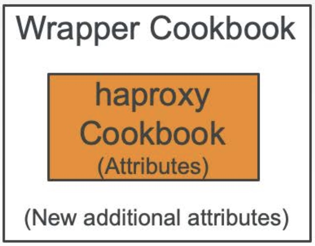

# 10. Community Cookbook
* Like Dockerhub, Chef has Supermarket which you can use cookbooks written by someone
* https://supermarket.chef.io
*  Cookbook types: 
   *  resource cookbook - resource cookbooks provide extionsion for Chef Infra by defining new Chef Resources
   *  recipe cookbook - recipe cookbook use resources(from resource cookbooks) to declare how a system should be configured

## 10.1 searching cookbooks in Supermarket
1. visit https://supermarket.chef.io
2. select the search field and type in cookbook to search(in the scenario 'haproxy')
3. click the 'haproxy'link
4. On the top, there are several ways to install the cookbook(haproxy) - berkshelf, policyfile, knife command
5. README - README shows the resources that can be used if this cookbook is included in a node's runlist

## 10.2 Wrapper cookbook
* Using community cookbook directly to node is not recommnaded
* Wrapper Cookbook is recommanded  - Wrapper cookbook is encapsulates the functionality of the original cookbook like PORXY PATTERN in programming


## 10.3 Creating dependancy in the cookbook
* In metadata.rb, add line - depends ['PUBLIC_COOKBOOK'] ['= VERSION']

```ruby
# syntaax
depends ['PUBLIC_COOKBOOK'] ['= VERSION']

#example
depends 'haproxy' '~> 12.2.2'
```

## 10.4 apply haproxy cookbook to recipe
```ruby
# in recipe file ~/chef-repo/cookbooks/myhaproxy/recipes/default.rb

haproxy_install 'package'

haporxy_frontend 'http-in' do
    bind '*:80'
    default_backend 'servers'
end

haproxy_backend 'servers' do
    server [
        'ec2-54-175-46-23.compute-1.amazonaws.com 54.175.46.24:80 maxconn 32',
        'ec2-34-196-10-17.compute-1.amazonaws.com 34.196.10.17:80 maxconn 32'
    ]
    # server is the end-point of nodes conneted with proxy
end

haproxy_service 'haproxy'

```