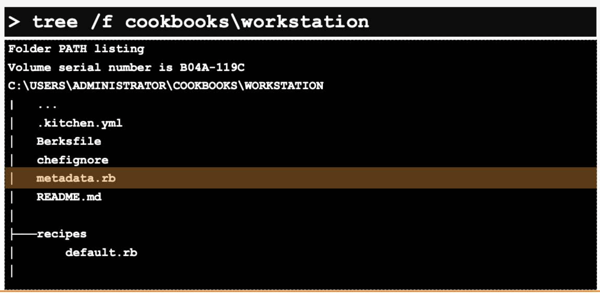

# 2. Cookbook
[Cookbook Reference](https://docs.chef.io/cookbooks/)
## 2.1 What is Chef Cookbook
* A chef Cookbook is the fundamental unit of configuration and policy distribution
* Cookbook usually maps 1:1 to an application or to a scenario.

## 2.2 What is Chef
* An executable program that generates cookbooks and cookbook components

### 2.2.1 Chef commands
**chef --help command**
```ruby

chef --help  #displays chef commands in general 
chef generate --help  #displays discriptions of chef generate commands
chef generate cookbook --help #display detailed discription on chef 
  

```

**generate cookbook command**
```ruby
#generate cookbook
$ chef generate cookbook [directory]

$ chef generate cookbook cookbooks\workstation
# ./cookbooks/workstation 디렉터리를 쿡북으로 만듬
```

**tree /f [directory] command**
```ruby
$ tree /f [directory]

$ tree /f \cookbooks\workstation
#will display tree structure of cookbook 'workstation' 
```


## 2.3 Handling Cookbook
### 2.3.1 metadata.rb
* Every cookbook has metadata stored in metadata.rb file
* metadata.rb is located at the top of each cookbook directory


### 2.3.2 chef-client
```ruby
$ chef-client --local-mode --runlist "recipe[COOKBOOK::RECIPE]" #syntax

$ chef-client --local-mode --runlist "recipe[workstation::disable-uac]" #example
```

* chef-client runs locally on every node managed by Chef
* chef-client brings nodes to desired statement
* --runlist "recipe[COOKBOOK::RECIPE]" : in local mode, we need to provide a list of recipes to apply to the system
* runlist is an ordered collection of recipes to execute

### 2.3.3 include_recipe 'COOKBOOK::RECIPE'
```ruby
# in a default recipe (~\cookbooks\workstation\recipes\default.rb)

include_recipe 'workstation::disable-uac'
```
* in the default recipe, adding disable-ual recipe whick is recipe of worksation cookbook

### 2.3.4 --runlist "recipe[COOKBOOK]"
```ruby
$ chef-client --local-mode --runlist "recipe[workstation]"
```
* --runlist "recipe[COOKBOOK]" runs default recipe of the cookbook

### 2.3.5 cookstyle
```ruby
$ cookstyle #inspecting syntax erros in the cookbook. it must run in cookbook directory 

$ cookstyle default.rb # insepecting specific recipe file

$ cookstyle -a # it auto corrects syntax errors
```


