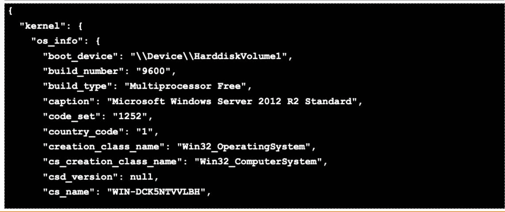
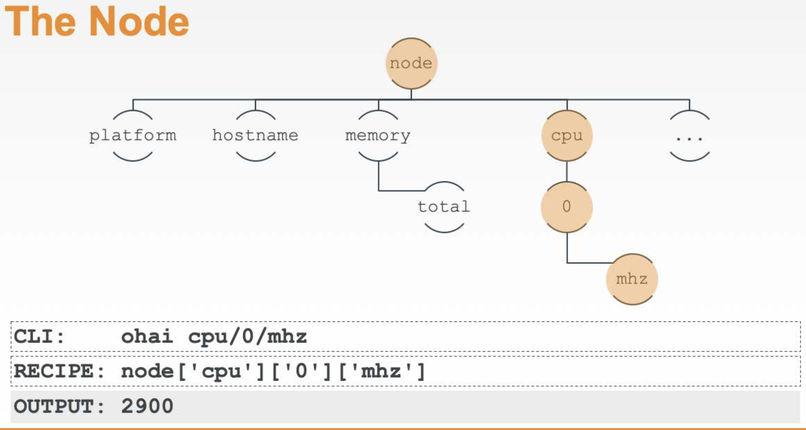

# 3. Ohai & Nod object
* Ohai - Ohai is a tool that captures all the data on machine's system such as OS, hardware, network information.
* Node Object - node object is a representation of system. it stores all the attributes found about the system (result of ohai run)

## 3.1 Ohai command


```ruby
$ ohai #displays all the system data

$ ohai platform # display platform data of the system

$ ohai hostname # display hostname data of the systme

$ ohai memory/total #display memory amount specifically total memory (node object has depth!)

```

## 3.2 Node Object
**Structure of Node Object(Depth)**


```ruby
# in CLI
ohai cpu/0/mhz

# in recipe file
node['cpu']['0']['mhz']
```
**Example of using node object in recipe file**
```ruby
# ... powershell_script resource

file 'C:\inetpub\wwwroot\Default.htm' do
    content "<h1>Computer specifications</h1>
    <h2> platform: #{node['platform']}</h2>
    <h2> hostname: #{node['hostname']}</h2>
    <h2> memory: #{node['memory']['total']}</h2>
    <h2> cpu mhz: #{node['cpu']['0']['mhz']}</h2>
    "
end

# ... service resource
```


