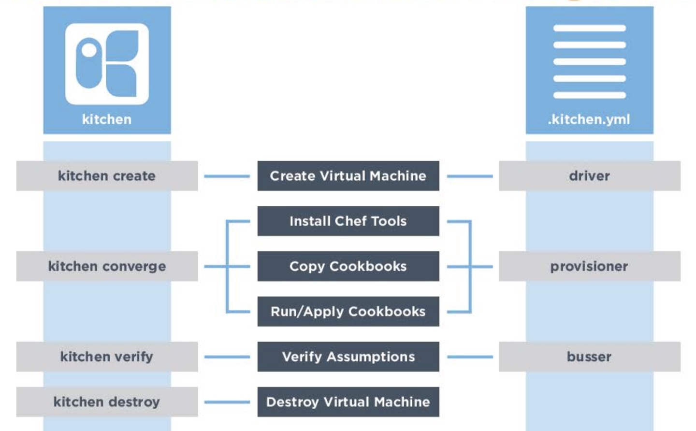

# 4. Kitchen
[Kitchen Reference](https://docs.chef.io/config_yml_kitchen.html)

* Kitchen is unit testing tool for cookbooks
* kitchen provide testing environments on vritual machine
* the environment configured in kitchen.yml

## 4.1 kitchen.yml
* when cookbook generated, default kitchen.yml is also created
* kitchen.yml contains configuration for driver, provisioner, platform, suites
**kitchen.yml file (test environment configuration)**
```yml
---
driver:
  name: vagrant

## The forwarded_port port feature lets you connect to ports on the VM guest via
## localhost on the host.
## see also: https://www.vagrantup.com/docs/networking/forwarded_ports.html

#  network:
#    - ["forwarded_port", {guest: 80, host: 8080}]

provisioner:
  name: chef_zero
  cookbook_path: ~/chef-repo/cookbooks/myiis
  client_rb:
    chef_license: accepted
    product_name: chef
    product_version: 15
  ## product_name and product_version specifies a specific Chef product and version to install.
  ## see the Chef documentation for more details: https://docs.chef.io/config_yml_kitchen.html
  #  product_name: chef
  #  product_version: 15

verifier:
  name: inspec

platforms:
  - name: ubuntu-18.04
  - name: centos-7

suites:
  - name: default
    run_list: 
      - recipe[myiis::default] # - recipe[COOKBOOK_NAME::RECIPE to test]
    verifier:
      inspec_tests:
        - test/integration/default # test file location (testing logics)
    attributes:
```
**kitchen.yml attributes**
* driver - driver is responsible for creating a machine to test
* provisioner - this tells how to run Chef to test under the virtual machine
* platform - platform is operating systems to test
* suites - suites is definition of what we want to test including run-list of recipes

## 4.2 Kitchen commands and configuration


## 4.3 Inspec
* Inspec is testing logics that actually runs on the test kitchen server
* when **kitchen verity** command runs the test logic will be tested

**example test file**
```ruby
# file : ~/cookbooks/workstation/test/integeration/default/default_test.rb

system_policies = 'HKLM\Software\Windows\CurrentVersion\Policies\System'

describe registry_key('System Policies', system_policies) do
    its('EnableLUA') { should eq 0 }
    its('ConsentProptBehaviorAdmin') { should eq 0 }
end
```