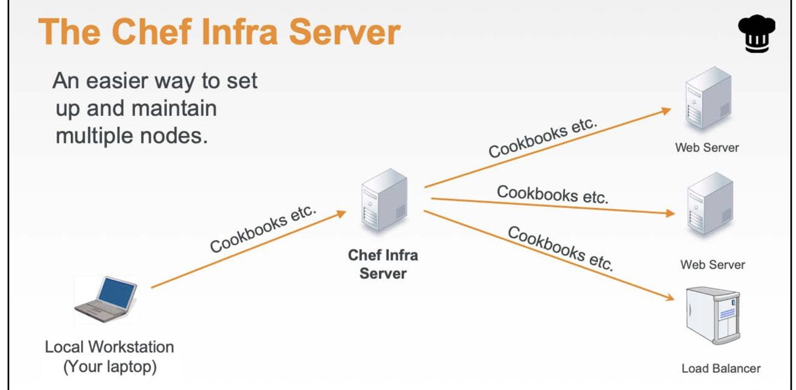

# 7. Chef Infra server
* server that manages chef nodes
* to apply cookbooks to nodes, cookbook has to be located under **chef-repo/cookbooks**

## 7.1 Infra server structure


## 7.2 knife
*  knife is a command line tool that provide interface between local chef-repo and chef infra server

* commands:
  * knife node list
  * knife node show [NODE NAME]
  * knife client list
  * knife bootstrap

### 7.2.1 knife bootstrap - connecting node to infra server
**syntax**
```shell
# for windows platform node
$ knife bootstrap -o winrm [IP ADDRESS of the node] -U [USERNAME of the node] -P [PASSWORD] -N [NODE name to create]

$ knife bootstrap -o winrm 192.168.0.2 -U Admin -P 1234 -N iis_web

# for lenux platform node
$ knife bootstrap [IP ADDRESS of the node] -U [USERNAME of the node] -P [PASSWORD ] --sudo -N [NODE name to create]

$ knife bootstrap 192.168.0.3 -U probsno -P 1234 --sudo -N apache_web_node1

```
