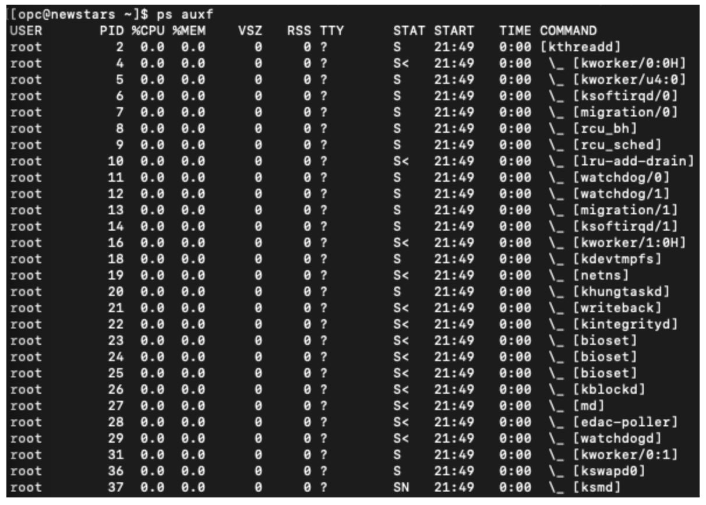

# 2. 프로그램 다루기
## 2.1 &
## 백그라운드 실행
```
$ [프로그램 실행 명령어] &
$ java &
```
**옵션 없음**

---
## 2.2 jobs
## 실행중인 명령어 표시
```
$ jobs [옵션] [작업 번호]
$ jobs -l
$ jobs -l %3
$ jobs %cat
```
**옵션**
* -l : 프로세스 아이디 표시
* -p : 작업 그룹 리더(작업을 구성하는 여러 프로세스 중에서 제일 처음 입력한 명령어로 실행한 프로세스)의 프로세스 ID만 표시

**작업번호 지정방법**
* 현재 작업 : %% %+
* 이전 작업 : %-
* n번 작업 : %n
* 명령어 명이 string으로 시작하는 작업 : %string
* 명령어에 string이 포함된 작업 : %?string

---
## 2.3 fg
## 포그라운드로 실행하기
```
$ fg [작업번호]
$ fg %3
$ fg %cat
```
**옵션 없음**

**작업번호 지정방법**
* 2.2의 jobs의 작업번호 지정방법과 동일

---
## 2.4 ps
## 프로세스 상태 확인
```
$ ps [옵션] [프로세스 ID]
$ ps -al 
$ ps -l 42345
```

**옵션**
* -u : 사용자 명과 시각을 표시
* -a : 모든 사용자의 프로세스 정보를 표시
* -x : 제어 터미널에 없는 프로세서 정보(데몬 등)을 표시
* -l : 더 상세한 정보를 표시
* -f : 프로세스의 부모 자식 관계를 트리형태로 표시
* -w : 프로세스 정보 표시 내용을 늘림
* -j : 부모 프로세스, 프로세스 그룹과 같은 정보를 표시
* -m : 쓰레드를 표시
* ttty : tty에서 제어하는 프로세스만 표시
* U user : 특정 유저가 사용하는 프로세스만 표시



**주요 표시 항목**
* USER - 사용자 명
* UID - 사용자 ID
* PID - 프로세스 ID
* PPID - 부모 프로세스 ID
* TT, TTY - 제어 터미널
* STAT - 프로세스 상태 정보
  
  |프로세스 상태|보조 정보|
  |-|-|
  |R : 실행가능 상태|< : 우선 순위가 높은 프로세스|
  |S : 슬립 상태|N : 우선순위가 낮은 상태|
  |D : 디스크 내부| L : 메모리에서 락이 걸린 페이지가 있음|
  |T : 정지 상태|s : 섹션 리더|
  |Z : 좀비 상태| l : 멀티 스레드|
    
* TIME - cpu시가 
* COMMAND, CMD - 명령어 
* %CPU - cpu 이용률
* %MEM - 메모리 이용율
* SIZE - 가상 이미지 크기
* RSS - 실제 메모리 크기
* START - 시작 시각
* FLAGS - 플래그
* NI - 프로세스 우선순위
* WCHAN - 프로세스가 대기 상태일 때 커널 함수명
* PAGEIN - 페이지 폴트 횟수
* TSIZ - 텍스트 크기
* DSIZ - 데이터 크기
* LIM - 메모리 제한

---
## 2.5 kill, killall
## 프로세스 종료하기
```
$ kill [옵션] [프로세스ID]
$ kill -9 23245

$ killall [옵션] [프로세스명] 
$ killall -15 24245
```
** kill은 프로세스ID로 종료/ killall은 프로세스명으로 종료

**옵션**
* -signal : 지정한 시그널을 프로세스에게 보냄
* -l : 시그널 목록 표시


**주요 시그널**
* -TERM / -15 : 프로세스 종료신호를 보냄
* -QUIT / -3 : 프로세스에 종료신호를 보냄 (core작성)
* -KILL / -9 : 프로세스에 강제 종료신호를 보냄
* -HUP / -1 : 프로세스에 재시작 신호를 보냄
* -STOP / -17 : 프로세스에 정지신호를 보냄
* -CONT / -19 : 프로세스에 재게신호를 보냄
* -INT / -2 : 프로세스에 끼어들기 신호를 보냄 (interrupt - 컨택스트 스위칭등)

---
## 2.6 nice
## 우선순위 변경
```
$ nice [옵션] [실행 명령어]
$ nice java 
$ nice -3 java
```

**옵션**
* -number : 명령어 nice 값에 number로 지정한 값을 설정해서 명령어를 실행
* -n number : 명령어 nice 값에 number로 지정한 값을 설정해서 명령어를 실행

---
## 2.7 sleep
## 특정 시간만큼 재우기
```
$ sleep [사간단위]
$ sleep 1m
$ sleep 1d 2h 25m
```
**시간단위**
|시간 단위|기호|
|-|-|
|초|s|
|분|m|
|시|h|
|일|d|

## crontab
## 배치 실행
```
$ crontab [-u 사용자명] [파일]
$ crontab [-u 사용자명] [기타옵션]

$ crontab -u myname -e //크론탭의 myname사용자로 크론탭 편집
$ crontab -l //크론탭에 등록된 내용 전체 보기
$ crontab -r //크론탭에 등록된 내용 삭제
$ crontab -u myname -l //myname사용자가 등록한 크론탭 목록 보기

```
**옵션**
* -l : 크론탭에 등록된 배치 시각과 명령어 목록을 표시
* -r : 등록 취소
* -e : 에디터로 직접 편집하기

**크론탭 등록방법**
1. vi .crontab 으로 파일 생성 또는 열기
2. 분 시 일 월 년 실행할파일.sh 를 .crontab에 등록 e.g. * * * * * batch_job.sh
3. service crond start 로 크론탭 데몬 재시작

