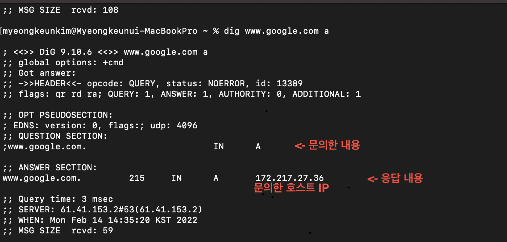
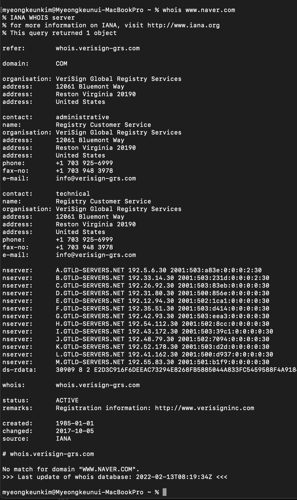
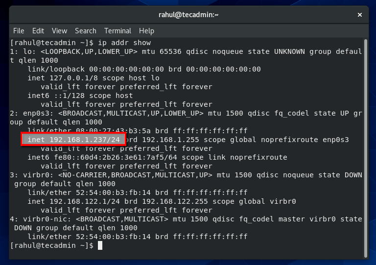

# 8. 네트워크 다루기
## 8.1 ping
## 접속 연결 확인 
```shell

$ ping [옵션] [상대호스트]

$ ping 201.32.2.24
$ ping www.naver.com

```
**옵션**
* -c count : Ping패킷을 보낼 횟수를 지정
* 

---

## 8.2 tracepath, traceroute
## 원격 호스트로 향하는 패킷 경로 추적

* 우분투의 경우 - tracepath, traceroute 둘다 사용가능 (/usr/bin/tracepath , /usr/sbin)
* centos의 경우 - traceroute 만 사용가능 (/usr/bin/traceroute)

```shell
$ tracepath [옵션] [호스트:포트]
$ traceroute [옵션] [호스트] [패킷길이]

$ tracepath 202.23.4.124
$ tracepath www.naver.com

$ traceroute 202.23.4.124
$ traceroute www.naver.com
``` 
**tracepath 옵션**
* -n : 주소를 호스트명이 아니라 IP로 표시
* -l len : 패킷 길이를 len으로 섭정

**traceroute 옵션**
* -n : 주소를 호스트명이 아니라 IP로 표시
* -m maxttl : ttl을 maxttl로 설정
* -p port : udp 패킷을 port번 포트로 보냄
* -I : udp패킷대신 ICMP패킷으로 보냄

---

## 8.3 host
## 호스트 ip주소, 도메인명 검색
```
$ host [옵션] [호스트명 or IP주소]

$ host 203.4.22.25
$ host www.naver.com

```
**옵션**
* -v : 상세정보를 표시

---

## 8.4 dig
## dns 정보 검색

```shell
$ dig [도메인명[-x]] [IP주소] [쿼리타입]
$ dig [@서버] [도메인명[-x]] [IP주소] [쿼리타입] # 쿼리 타입 이 없으면 

$ dig @ns.example.com www.naver.com
$ dig @ns.example.com -x www.naver.com
```
**검색 결과**


**옵션**
* -x address : ip 주소가 address인 호스트의 dns정보를 검색

||쿼리 타입|
|-|-|
|a|지정한 호스트의 IPv4|
|aaaa|지정한 호스트의 IPv6|
|any|모든정보|
|mx|지정한 도메인의 메일서버|
|ns|지정한 도메인의 공인 네인서버|
|ptr|지정한 ip주소의 PTR(domain name pointer)|
|soa|지정한 도메인의 SOA(start of zone of Authority)|
|hinfo|지정한 호스트 관련 정보(CPU, OS)|
|axfr| ZONE 정보|
|txt|도메인의 텍스트 정보|

---

## 8.5 whois 
## 도메인 정보 취득

```
$ whois [옵션] [도메인명]

$ whois www.naver.com
```
**옵션**
-h server : 검새에 사용할 네임서버 지정

**whois 검색결과**


---

## 8.6 ssh
## 안전하게 서버에 접속하기 

```
$ ssh [사용자명]@[호스트명] [명령어]
$ ssh [-l 로그인사용자명] [호스트명] [명령어]

$ ssh myName@hostname.com
$ ssh -l myName hostname.com

```
**ssh공개키 인증**
* 계정 암호를 사용하는 대신에 공개키 암호를 사용할 수 있음
* 암호화/복호화에 사용할 공개키와 비밀키는 ssh-keygen으로 생성가능
* ssh-keygen하면 공개키는 ~/.ssh/id_rsa.pub 으로 저장
* 비공개키는 ~/.ssh/id_rsa로 저장
**ssh 키생성 및 등록 step**
1. ssh-keygen으로 rsa키(공개키 비공개키) 생성
2. passphase(비밀번호) 입력
3. 공개키는 ~/.ssh/id_rsa.pub 비공개키는 ~/.ssh/id_rsa 로 생성됨
4. 접속한 원격호스트의 ~/.ssh/authorized_keys파일에 공개키 추가
5. 접속할때 사용자 비번이 아니라 rsa공개키와 비공개키로 인증해서 원격 서버에 접속

## 8.7 wget, curl
## 지정한 url 다운로드
* wget은 재귀적으로 사용해서 url아래에 속한 url들을 따라가면 다운가능 / curl은 재귀적으로 다운 불가능
```
$ wget [옵션] [url]
$ curl [옵션] [url]

$ wget -c www.example.com/file1.tgz
$ curl -O  www.example.com/file2.tgz
```

**wget 옵션**
* -b : 백그라운드로 다운로드
* -i file : 지정한 파일에 적힌 url을 다운로드
* -r : 링크를 재귀적으로 다운로드
* -c : 이어받기로 다운로드
* -q : 메시지 출력 없이 다운로드

**curl 옵션**
* -O : 다운로드한 결과를 url에서 가저온 파일명으로 저장
* -o file : 다운로드한 결과를 file파일로 저장
* -C offset offset바이트 위치에서 이어서 다운로드

---

## 8.8 ftp, lftp
* 호스트 끼리 파일을 전송하고 싶을 때 사용
* 원격 호스트에 접속후 mget, mput등의 내부명령어를 사용해서 전송함
* ftp 와 lftp의 차이는 거의 없지만 편리성에서 lftp가 제공하는 기능이 더 많음

```
$ ftp [접속 호트스]
$ lftp [접속 호스트]

$ ftp 204.3.24.4
$ lftp 204.3.24.4

```
**내부 명령어**
* open hostname : hostname호스트에 FTP접속
* close : 현재 호스트와의 접속 끊기
* quit : ftp 명령어 종료
* ls [dir] : dir디렉토리로 표시
* cd [dir] : dir디렉토리로 이동
* mget file : file파일을 내 호스트로 전송
* mput file : file파일을 상대 호스트로 전송
* pwd : 현재 디렉토리 표시
* ? : 사용 가능한 명령어 표시

---

## 8.9 scp, sftp
## 안전하게 파일 전송
* 암호화를 통해 보다 보안에 안전하게 파일을 전송
```
$ scp [옵션] [사용자명]@[호스트명]:[원격호스트의 전송할 path] [전송할 파일명]
$ sftp [접속할 호스트명]

$ myUser@myHost:/dir1/fileName file1.txt
$ myUSer@204.42.242.25:/dir1/fileName file1.txt

$ sftp 204.24.242.25 
$ sftp myRemote-host
```
**scp 옵션**
* -r : 디렉터리를 통째로 복사
* -p : 날짜나 파일 관련 정보를 가능한 그대로 복사

**sftp 내부 명령어**
* ls [dir] : dir디렉터리를 표시
* cd [dir] : dir디렉터리로 이동
* mget file : file파일을 로컬 호스트에 전송
* mput file : file파일을 원격 호스트에 전송
* pwd : 원격 호스트의 현재 디렉터리 표사
* ? : 사용 가능한 명령어 표시
* quit : sftp 종료

---

## 8.10 ip addr
## ip주소 확인및 설정
* 할당된 ip 주소를 확인하거나, 새로 ip주로를 할당하기 위해 사용

```
$ ip [옵션] addr [내부명령어]

$ ip addr show
```

**ip addr 옵션**
* -s : 상세정보 표시
* -f family : 네트워크 주소 종류family를 inet,inet6,link중에 지정
* -r : 호스명을 표사

**ip addr 내부명령어**
* ip addr show dev [device]: device의 주소를 표시 
* ip addr add [address] dev [device] : device에 address주소를 추가
* ip addr del [address] dev [device] : device에 address주소를 삭제
* ip addr flush dev [device] : device의 모든 주소를 삭제

### 8.10.1 ip 주소 확인과 기초
**ip addr show명령어**
```
$ ip addr show
```
**ip addr show 결과**

* lo는 루프백 , eth0은 인터페이스 이더넷0 

### 8.10.2 ip주소 할당
* 네트워크 인터페이스에 ip주소 할당
* 내부명령어 flush & add
```shell
$ ip addr flush dev eth0 # eth0인터페이스에 주소를 모두 삭제
$ ip addr add 10.0.2.12/24 dev eth0 # eth0인터페이스에 ip주소 할당

```

---

## 8.11 ifconfig
## ip주소 확인 및 설정
```shell
$ ifconfig [옵션] [인터페이스] inet [ip주소] netmask [넷마스크]

$ ifconfig #네트워크 인터페이스 정보 확인
$ ifconfig -a eth0 inet 204.24.53.2 netmask 255.255.255.0 # eth0에 주소 추가
```
**ifconfig 옵션**
* -a : 모든 인터페이스 설정을 표시


### 8.11.1 ip주소 확인
**ifconfig 명령어**
```
$ ifconfig
```
***ifconfig 명령어 결과*

* lo는 루프백 , eth0은 인터페이스 이더넷0 

### 8.11.2 ip주소 할당
* 네트워크 인터페이스에 ip주소 할당
```shell
$ ifconfig eth0 inet 10.0.0.12 netmask 255.255.255.0
```

## 8.12 nmcli
## 네트워크 인터페이스 설정
```
$ nmcli [옵션] [조작대상] [조작명령어]

$ nmcli -p con status
$ nmcli -p dev show
```
**nmcli 옵션**
* -p : 읽기 편하게 출력

**nmcli 조작대상**
* dev : 네트워크 인터페이스를 조작
* con : 네트워크 접속을 조작

**nmcli 조작명령어**
* show [id] : 네트워크 id 상태를 표시 
* up [id] : 네트워크 접속 id를 연결
* down [id] : 네트워크 접속 id를 정지
* modify [id] setting : 네트워크 접속 속성을 변경, setting 설정에는 property속성과 value공백문자로 구분해서 지정, modify를 mod로 줄여서 쓰기도 함

### 8.12.1 네트워크 인터페이스 서정
```shell
$ nmcli con down eth\ 1 # eth 1 네트워크 접속 정지
$ nmcli con mod eth\ 1 ipv4.method manual ipv4.address 10.2.0.11/24 #호스트 ip주소를 고정주소 10.0.2.11/24로 설정
$ nmcil con mod eth\ 1 ipv4.gateway 10.0.2.2 # 게이트웨이를 10.0.2.2로 설정
$ nmcli conf mod eth\ 1 ipv4.dns 192.168.0.1 # 네임서버를 192.168.0.1로 설정
```

---

## 8.13 ip route, route
## 인터넷 경록 설정
* 라우팅 테이블을 ㅓㄹ정 표시하려명 ip명령어로 route내부명령어를 사용하거나 route명령어를 사용

```shell
$ ip route [내부명령어]
$ route [옵션] [내부명령어]

$ ip route # 라우팅 테이블 표시
$ ip route add 10.0.2.0/24 dev eth0 # 라우팅 테이블에 엔트리 추가
$ ip route add default via 10.0.2.1 dev eth0 # 디폴트 게이트웨이 설정

$ route # 라우팅 테이블 표시
$ route add -net 10.0.2.0 netmask 255.255.255.0 dev eth0 # 라우팅 테이블에 엔트리 추가
$ route add default gw 10.0.2.1 # 디폴트 게이트웨이 설정

```
**route 옵션**
* -n : 호스트명이 아니라 ip주소로 표시

**ip 내부명령어**
* ip show dev [device] : device디바이스의 라우팅 테이블을 표시함
* ip get [address] : address 주소를 향한 결로를 표시
* ip [address1] via [address2] dev [device] : device 디바이스의 라우팅 테이블에 address1을 향한 경로로 address2를 추가
  
**route 내부 명령어**
* add [entry] : 라우팅테이블에 entry엔트리를 추가
* del [entry] : 라우팅테이블에 entry엔트리를 삭제

**route엔트리 지정방법**
* -net [target] : 엔트리 네트워크를 target으로 지정
* -host [target] : 엔트리 호스트를 target으로 지정
* netmask [mask] : 엔트리 서브넷 마스크를 mask로 지정
* dev [interface] : 네트워크 인터페이스 interface의 경로를 설정

---

## 8.14 ss
## 네트워크 소켓정보 표시
* netstat은 deprecated되었으므로 ss를 추천함
  
```shell
$ ss [옵션]

$ ss
$ ss -ant
```
**옵션**
* -s : 각 프로토콜의 통계정보를 표시
* -a : 사용중이 아닌 소켓 정보도 표시
* -l : 접속 대기 상태인 소켓만 표시
* -n : 네트워크 주소를 숫자로 표시
* -t : tcp소켓정보를 표시
* -u : udp소켓 정보를 표시
* -x : unix 도메인 소켓 정보를표시

**ss실행**
```
Netid State Recv-Q Send-Q          Local Address:Port Peer Address:Port   Process
u_str ESTAB 0      0                           * 41826           * 41827
u_str ESTAB 0      0 /run/systemd/journal/stdout 35689           * 35688
u_str ESTAB 0      0                           * 35550           * 35551
...
u_str ESTAB 0      0                           * 38127           * 38128
u_str ESTAB 0      0 /run/dbus/system_bus_socket 21243           * 21242
u_str ESTAB 0      0                           * 19039           * 19040
u_str ESTAB 0      0 /run/systemd/journal/stdout 18887           * 18885 
u_str ESTAB 0      0 /run/dbus/system_bus_socket 19273           * 17306
icmp6 UNCONN 0     0                           *:ipv6-icmp       *:*
udp   ESTAB 0      0         192.168.4.28%enp0s3:bootpc 192.168.4.1:bootps
```
* Netid : 프로토콜 명(tcp,udp,u_str등)
* State : 소켓 상태(LISTEN, ESTAB등)
* Recv-Q : 수신 실패 데이터 바이트 수
* Send-Q : 송신 실패 데이터 바이트 수
* Local Address:Port - 소켓에 연결된 경로명 또는 로컬 호스트(ip주소:포트)
* Peer Address:Port - 원격호스트명과 포트번호

---

## 8.15 netstat 
## 네트워크 소켓 정보 표시
* netstat은 deprecated되어서 ss를 추천

```
$ netstat [옵션]

$ netstat
$ netstat -a
$ netstat -ant

```

**netstat옵션**
* -i : 네트워크 인터페이스 접속 상태 관련 정보를 표시
* -r : 라우팅 테이블을 표시
* -s : 각 프로토콜 통계를 표시
* -a : 사용중이 아닌 소켓정보도 표시, -i 옵션과 함께 지정하면 각 네트워크 인터페이스 및 IP주소에 대해 사용중인 모든 멀티케스트 주소를 표시
* -l : 접속 대기상태인 소켓만 표시
* -n : 네트어크 주소를 숫자로 표시
* -t : tcp 소켓 정보를 표시
* -u : udp 소켓 정보를 표시
* -x : unix 도메인 소켓 정보를 표시
* -p : 프로그램 이름 & PID표시

**netate 실행**
```
 netstat -antplF
Proto Recv-Q Send-Q Local Address           Foreign Address         State       PID/Program name
tcp        0      0 127.0.0.1:631           0.0.0.0:*               LISTEN      -   
tcp        0      0 127.0.0.1:25            0.0.0.0:*               LISTEN      -      
tcp        0      0 127.0.0.1:9050          0.0.0.0:*               LISTEN      -     
tcp        0      0 127.0.1.1:53            0.0.0.0:*               LISTEN      -   
tcp        0      0 192.168.0.100:44952     144.76.244.204:443      ESTABLISHED 2705/chromium-brows
tcp        0      0 192.168.0.100:49334     66.196.66.212:443       ESTABLISHED 6796/firefox  
tcp        0      0 192.168.0.100:40249     69.171.235.19:443       ESTABLISHED 6796/firefox   
```
* Proto : 프로토콜명 (tcp, udp, raw등)
* Recv-Q : 수신 실패 데이터 바이트 수
* Send-Q : 송신 실패 데이터 바이트 수
* Local Address : 로컬 호스트 명 & 포트번호
* Foreign Address : 원격 호스트 호스트명 & 포트번호
* State : 소켓 상태

---

## 8.16 ip link
## 네트워크 접속상황 표시
```
$ ip [옵션] link [내부명령어]

$ ip -s link

```
**ip link 옵션**
* -s : 상세정보 표시
* -f family : 네트워크 주소 종류 family를 inet, inet6, link중에 지정
* -r : 호스트명 표시

**ip link 실행 결과**
```
ip link show

1: lo: <LOOPBACK,UP,LOWER_UP> mtu 65536 qdisc noqueue state UNKNOWN mode DEFAULT group default qlen 1000
     link/loopback 00:00:00:00:00:00 brd 00:00:00:00:00:00
2: eth0: <BROADCAST,MULTICAST,UP,LOWER_UP> mtu 1500 qdisc fq_codel state UP mode DEFAULT group default qlen 1000
     link/ether 52:54:00:8c:62:44 brd ff:ff:ff:ff:ff:ff
```
* lo, eth0 : 인터페이스 명
* mtu 65536, mtu 1500 : 최대 통신 단위
* 동일한 정보를 netstat -i로도 얻을수 있음

---

## 8.17 tcpdump
## 네트워크 인터페이스 트래픽, 데이터 표시하기

```shell
$ tcpdump [옵션] [조건]

$ tcpdump port 21 and src host ftp.example.com #원격호스트 ftp.example.com 에서 로컬호스트 21번 포트로 보내는 패킷을 취득
$ tcpdump -w tcpdump.log # 취득한 패킷정보를 tcpdump.log에 저장
$ tcpdump -r tcpdump.log # tcpdump.log파일에 저장된 패킷정보를 확인
```
**tcpdump옵션**
* -c [count] : count개의 패킷을 취득하고 종료
* -F [file] : 패킷 필터링 조건을 file에서 읽음
* -i [interface] : 인터페이스 interface 를 지정
* -n : ip주소/포트번호를 호스트명/서비스명으로 변환하지 않음
* -N : 호스트명 중에 도메인명을 표시하지 않음
* -q : 일부 정보를 제외한 형식으로 표시
* -w [file] : 수신한 패킷을 file파일에다 저장함
* -r [file] : 패킷을 file에서 읽어옴
* -T [type] : 취득한 패킷을 패킷종류 type으로 해석함 type에는 cnfp, rpc, rtp, rtcp, snmp, vat, wb가 있음
* -v : 상세정보를 표시
* -vv : -v보다 더 상세한 정보를 표시
* -vvv : -vv보다 더 상세한 정보를 표시

**tcpdump 조건(필터링)**

[형식]
|형식명|설명|사용 예|
|-|-|-|
|host [host_name]|호스트명 또는 ip주소 |host www.naver.com  / host 204.24.25.2|
|net [network_address] mask [subnet_mask]|net 네트워주소 mask 서브넷 마스크|net 204.24.25.2 / net 204.24.25.2 mask 255.255.255.0|
|port [port_number]|포트 번호 또는 서비스명| port 21 / port ftp|
---

[패킷 송신 방향]
|작성법| 설명|
|-|-|
|src|패킷 발신지 형식 type|
|dst|패킷 도착지 형식 type|
---

[논리 연산자]
|연산자| 설명|
|-|-|
|and|두 조건을 동시에 만족|
|or|두 조건중 하나만 만족해도 됨|
|not|조건과 일치하지 않는 경우만 됨|
---

[프로토콜]
|프로토콜 명| 설명|
|-|-|
|ether|이더넷|
|ip|ipv4|
|ip6|ipv6|
|arp|ARP|
|tcp|TCP|
|udp|UDP|
|icmp|ICMP|
|icmp6|ICMP6|
---

## 8.18 telnet
## 네트워크 서비스 확인
* 원격 네트워크의 서비스가 동작중인지, 포트가 열려있는지 확인하고 싶을때 사용
* 포트번호를 지정하지않으면 ssh접속처럼 23번포트를 사용해서 원격접속을 하지만, 패킷이 암호화되지 않기 때문에 ssh사용 적극권장


```
$ telnet [접속할 호스트명] [포트번호 or 서비스명]

$ telnet www.naver.com 80
$ telnet 204.24.25.2 80
$ telnet 205.25.24.2 ftp
```
