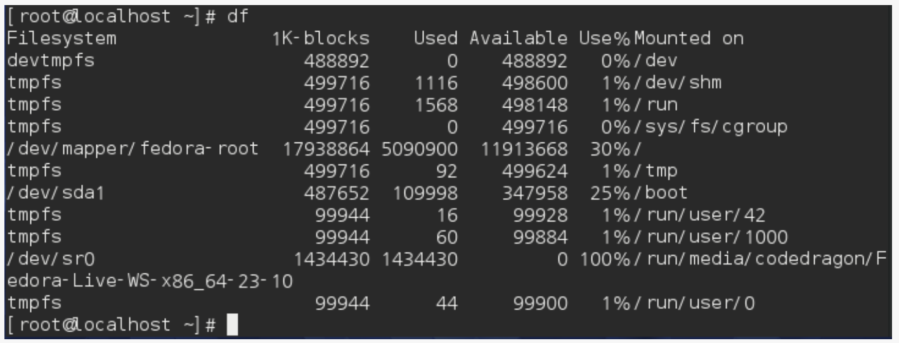

# 3. 사용자 및 시스템정보 표시 및 변경

## 3.1 date
## 현재시각 표시 및 변경
```
$ date [시각] //시간 변경
$ date +[패턴] //시간 표시 (해당 패턴으로)
$ date //시간 표시

$ date 20220525
$ date +%Y%m%d_%H%M%S
$ date
```
**옵션**
* -u : UTC표시

---
## 3.2 cal
## 달력 표시하기
```
$ cal [옵션] [월 또는 년도]

$ cal -y //올해 달력 표시
$ cal 2022
$ cal 7 2022
```
**옵션**
* -y : 올해의 달력 표시

---
## 3.3 whoami, groups, id
## 사용자 정보 표시하기
```
$ whoami //자신의 자용자명 표시
$ groups [사용자명] //사용자가 소속된 그룹 표시
$ id [옵션] [사용자명] //해당 사용자의 상세정보 표시

$ whoami
$ groups
$ groups username
$ id username
```

**옵션**
* -G : 소속 그룹 ID만 표시
* -g : 그룹 ID만 표시
* -u : 사용자 ID만 표시
* -n : 다른 옵션과 함께 사용하면 ID가 아니라 이름으로 표시

---
## 3.4 w
## 로그인한 사용자 정보 표시
```
$ w [옵션] [사용자명]

$ w //로그인한 사용자 전체 표시
$ W username
$ w -s
```
**옵션**
* -h : 해더를 표시하지 않음
* -f : 로그인 호스트명을 표시하지 않음
* -s : 표시하는 정로를 줄임

## 3.5 df
## 디스크 용량 확인
```
$ df [옵션]
$ df -a
```
**상세 정보**

|||
|-|-|
|Filesystem|디바이스|
|1k-blocks|디스크 용량|
|Used|사용한 용량수|
|Available|여유 용량|
|Use%|사용률|
|Mounted on|마운트 정보|

**옵션**
* -a : 모든 파일 시스템 관련 정보를 표시
* -h : 사람이 읽기 쉬운 단위로 표시 (1024의 배수)
* -H : 사람이 읽기 쉬운 단위로 표시 (1000의 배수)
* -t fstype : 파일 시스템 종류가 fstype인것만 표시

---
## 3.6 du
## 디렉터리 디스크 사용량
```
$ du [옵션] [디렉터리]

$ du //현재 디렉터리
$ du -a /home/username/dir1
```
**상세정보**
* 해달 디렉터리의 디스크 사용량을 표시함

**옵션**
* -a : 서브 디렉터리 단위가 아니라 파일마다 디스크 사용량을 표시
* -b : 표시할 디스크를 바이트 단위로 표시
* -h : 디스크 사용량을 1000의 배수로 표시(-b와 함께 사용하면 1024) 해서 읽기 쉽게 표시
* -s : 서브 디렉터리별 사용량을 생각하고 디렉터리 디스크 사용량 합계만 표시
* -d n : n단계의 서브 디렉터리 까지만 표시

---
## 3.7 passwd
## 패스워드 변경
```
$ passwd [사용자명]

$ passwd username
```

**옵션 없음**

---
## 3.8 last
## 사용자 로그인 기록 표시
```
$ last [옵션] [사용자명]

$ last
$ last username
```

**옵션**
* -n : n행 분량의 로그인 이력 표시
* -x : 런레벨 병경을 표시

---
## 3.8 uptime
## 시스템 가동시간 표시
```
$ uptime [옵션]

$ uptime
$ uptime -p
```
**옵션**
* -p : 가동시간만 표시
* -s : 시스템 시작한 시간만 표시

---
## 3.9 uname
## 시스템 정보 표시
```
$ uname [옵션]

$ uname
$ uname -a
```

**옵션**
* -n : 호스트명 표시
* -r : os릴리즈 정보 표시
* -v : 커널 컴파일 정보 표시
* -m : 머신 타입 표시
* -p : 프로세서 타입 표시
* -a : 모든 정보 표시