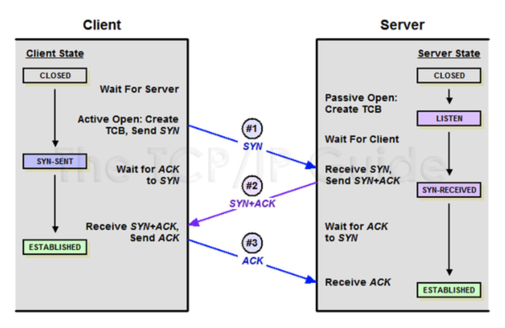
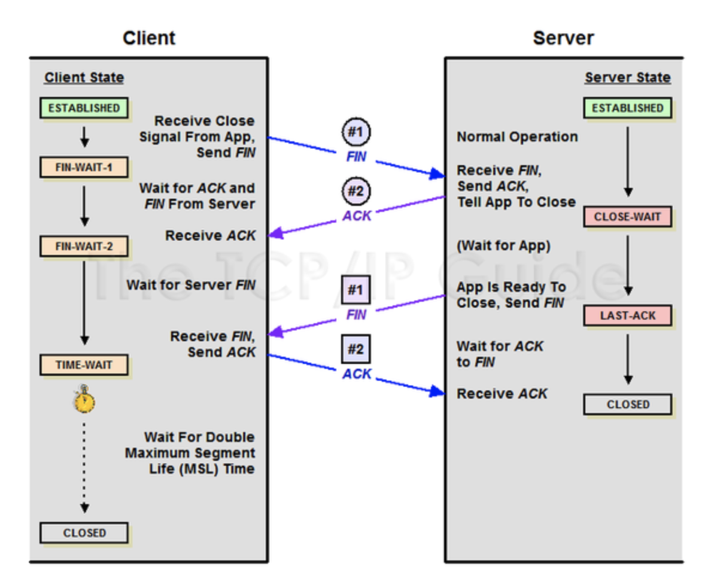

## TCP 프로토콜
* TCP 프로토콜은 연결 지향 프로토콜임
* TCP프로토콜은 서버와 클라이언트가 연결되어서 패킷이나 순서들을 보장함(순서가 틀리게 되면 재정렬을 함) 
* 따라서 신뢰성을 바탕으로 하는 HTTP, FTP, TELNET등에서 전송계층으로 쓰임

## UDP프로토콜
* UDP는 비연결 지향 프로토콜임
* 따라서 UDP는 제대로 데이터가 전송이 되었는지 관심이 없음 - 대신에 TCP보다 빠름
* 동영상 스트리밍등에 적합함

### TCP 연결/종료 프로세스
* TCP는 연결지향 프로토콜이기 때문에 특별한 연결 및 연결 해제 과정이 필요함 (UDP는 불필요)
* 연결시에는 3way handshake/ 연결 해제시 4way handshake라는 프로세스를 사용
* UDP는 비연결 지향이기 때문에 이러한 프로세스 필요없이 바로 데이터그램을 보내버림

### 3way handshake

1. 클라이언트가 SYN패킷을 서버에게 보냄
2. 서버는 SYN패킷을 받고 ACK패킷과 SYN패킷을 동시에 클라이언트에게 전달
3. 클라이언트는 서버가 보낸 ACK패킷과 SYN패킷을 받고 ACK패킷을 서버에 보냄

* 2way handshake가 아닌 3way handshake인 이유:
  * 만약에 2way로 서버가 패킷을 받고 ACK패킷을 보내지 않는다면 서버는 클리이언트가 제대로 패킷을 받았는지 보장을 할수가 없기 때문에 3way handshake여야함
  
* 받을 ACK패킷이 진짜인지 아닌지 확인하기 위해서 쓰는 방법:
  * 서버와 클라이언트간에 여러번 패킷이 오가거나 기존에 연결에서 패킷이 남아 있을 경우 재사용 될 가능성이 있음
  * 따라서 진짜 내가 보낸 SYN에 ACK를 보낸것인지 확인할 방법이 필요
  * 따라서 서버든 클라이언트든 SYN패킷을 보낼때 랜덤값을 넘겨주고 ACK패킷을 돌려줄땐 SYN패킷에 랜덤 숫자에 +1을 해서 돌려줌
  * 따라서 서버 또는 클라이언트는 내가 보낸 SYN패킷에 제대로 ACK패킷을 보내준 것인지 확인이 가능함

### 4way handshake

1. 클라이언트가 FIN패킷을 서버에 보냄
2. 서버는 FIN패킷을 받고 ACK패킷으로 클라이언트에게 받았음을 확인시켜줌
3. 서버는 원하는 데이터를 마저 전송함
4. 다 전송하고난 후 FIN패킷을 클라이언트에게 전달함
5. 클라이언트는 FIN패킷을 받고 다시 서버에게 ACK패킷을 보내며 받았음을 확인시켜줌
6. 클라이언트는 혹시 서버가 보낸 데이터중 아직 도착하지 못한 데이터가 있을 수도 있으니 TIME-WAIT세션을 가진후 종료됨

*3way handshake가 아니라 4way handshake여야 하는 이유:
   * 클라이언트가 종료를 원한다고 하더라도 서버는 아직 보낼 데이터가 남아 있을 수 도 있음
   * 따라서, ACK패킷 먼저 보내서 받았음을 확인하고 남아있는 데이터를 클라이언트에게 보냄
   * 그리고나서 FIN패킷을 전송하기 때문에 연결때와는 다르게 4way handshake임

* 클라이언트가 TIME-WAIT세션을 가지는 이유:
  * 클라이언트가 서버로부터 FIN패킷을 받더라도 기다리는 이유는 라우팅 지연이나 기타 이유로 FIN패킷보다 늦게 도착하는 데이터가 있을 수도 있기 때문에