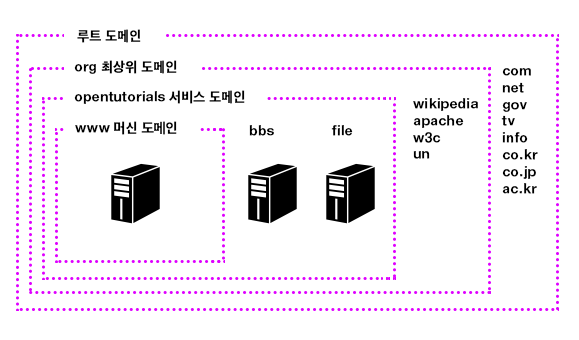
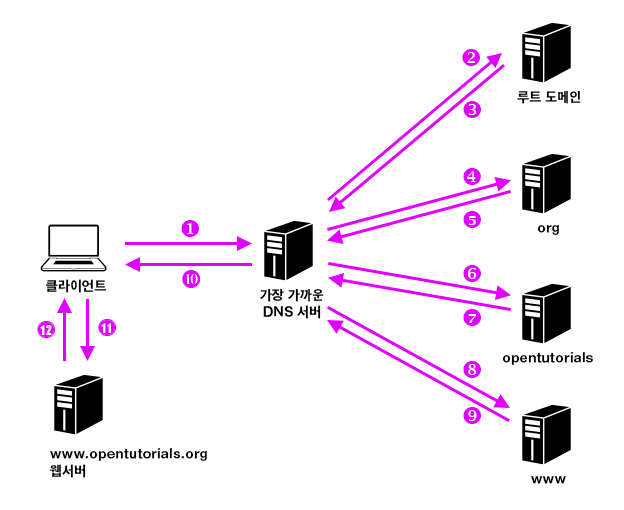

## DNS(Domain Name Service)

### DNS란?
* 인터넷상의 시스템(서버)에 접근할 때는 ip주소와 port번호를 사용함
* 하지만 ip주소를 그대로 사용하면 사람이 쓰기 불편하기 때문에 www주소를 ip주소로 변환하는 함
* 이러한 서비스를 해주는 것이 DNS서버

### 우리가 www.google.com으로 접속하기 까지의 과정
1. 도메인(www.google.com)을 브라우저 입력한다.
2. 브라우저가 DNS서버에게 ip주소를 물어본다
3. DNS서버가 브라우저에게 해당 도메인(www.google.com)의 ip주소를 알려준다
4. 브라우저는 ip주소로 웹서버에게 페이지를 요청함 (get매소드)
5. 웹서버가 요청한 페이지를 브라우저(클라이언트)에게 반환한다.

### IPv4 vs IPv6
|구분|IPv4|IPv6|
|---|---|---|
|품질 제어|품질보장 어려움 Qos(데이터 전송에 우선순위를 두어 성능보장) 일부지원|품질보장 용이 Qos 지원|
|표시 방법|8비트씩 4부분 10진수로 표시 예) 192.168.146.14|16비트씩 8부분으로 16진수로 표시 예) 1920:0230:abcd:ffff:0000:0000:ffff:1111|	
|주소길이|32비트|128비트|
|주소 개수|약 43억개|3.4x10^38 (거의 무한대)|
|이동성 지원|비효율적|효율적|
|보안 기능|IPsec(IP패킷을 암호화하고 인증하는 프로토콜) 프로토콜 별도설치|기본 제공|

### DNS 레코드
브라우저가 DNS서버에게 요청시 DNS서버는 도메인(www.google.com)과 매핑된 ip주소를 레코드로 가지고 있음. 그 매핑된 정보를 바탕으로 브라우저에게 ip주소를 알려주는 거임

DNS 레코드 유형
|||
|---|---|
|SOA|DNS의 기본 식별 레코드|
|A|도메인 이름 을 IPv4 에 연결해주는 기본 주소 레코드|
|AAAA|IPv6 주소를 기준으로 하는 레코드|
|CNAME|도메인 별칭 지정 레코드|
|MX|Mail 을 수신할 서버 지정 레코드|
|NS|도메인의  네임 서버 지정 레코드|
|SRV|호스트네임과 포트번호등을 저장하기 위해서 사용하는 레코드|
|PTR|IP주소로 도메인을 식별하는 레코드|

### 만약 가장 가까운 DNS서버가 도메인의 정보를 가지고 있지 않다면?

1. 클라이언트가 도메인과 매핑된 ip주소를 dns서버에게 물어봄
2. dns서버가 해당 레코드가 없다면 루트 도메인에게 물어봄
3. 루트도메인은 해당레코드를 확인하고 그 아래에 있는 dns서버에게 물어봄
4. 4~8번까지 원하는 레코드를 찾을 때 까지 반복함 (Higharchical structure - recursive calling)