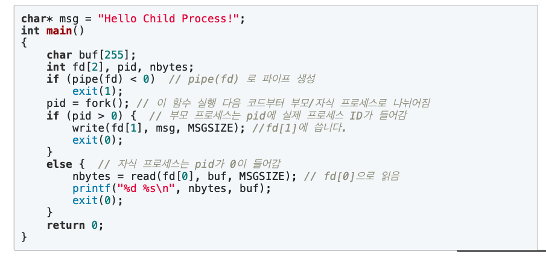
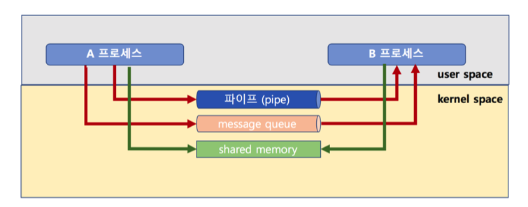

## IPC(Inter Process Communication)

### IPC란
* 원칙적으로는 프로세스간에 데이터를 주고 받을 수 없음 - 프로세스가 다른 프로세스의 데이터 영역(주소)에 침범하는걸 불허함(예상치 못하게 프로그램이 동작하기 때문에)
* 또한, 가상 메모리 구조를 가지고 있기 때문에 불가능 프로세스간에 값을 주고 받거나 접근하는것을 할 수가 없음 - 가상의 메모리 주소를 쓰고 있고 실제 메모리 주소는 노출되지 않음
* 때에따라서는 프로세스간에 특정한 값을 주고 받을 필요성이 있기 때문에 IPC기법을 사용하여 특정 프로세스에서 다른 프로세스로 값을 보내거나 받거나 할 수가 있음
* **프로세스는 1GB의 커널 메모리 영역을 공유하는데 이 공간을 이용해서 프로세스간에 통신을함(IPC)** \<- 매우 중요

### 프로세스의 커널 영역 매모리

* 프로세스는 총 4GB로 이중에 1GB의 영역을 커널 영역의 메모리 임(시스템 콜등을 사용할때 쓰임)
* 1GB의 커널 영역 메모리는 사실, 프로세스마다 별도로 가지고 있는 것이 아니라 모두 같은 메모리를 공유하고 있음
* 같은 메모리를 공유하고 있기 때문에, IPC기법을 사용할때 주로 이 커널영역 메모리가 사용됨
### IPC종류
* file사용 - 파일을 사용하여 특정프로세스에서 파일에 write하고 다른 프로세스에서 write한 파일을 read함(결과적으로 값을 전달함 - 매우 원시적이며 느림)
* Message queue - 메세지큐를 생성해서 특정 프로세스에서 다른 프로세스로 보냄 (커널 메모리 영역을 이용)
* Shared Memory - 커널 메모리 영역에 메모리를 할당해서 값을 저장함 - 나중에 다른 프로세스에서 키값을 이용해서 값을 가져올 수 있음
* Pipe - fork()자식 프로세스를 생성해서 값을 전달함
* Signal 
* Semaphore
* Socket - 웹 통신을 하는 것과 같이 socket을 사용해서 내부의 프로세스와 통신을 함

### 대표적인 IPC기법 설명

1. pipe기법
 
   
* 파이프는 부모프로세스를 복제(fork함수를 이용)해서 자식 프로세스에 값을 넘겨주는 방법
* 부모 -> 자식 으로 밖에 전달할 수 없는 단방향 IPC기법 
  
   **파이프 구현 코드**
   

3. Message queue기법
   
   
* 커널공간의 메모리를 사용하여 메세지를 담을 큐를 생성함
* 양방향 통신이 가능함
* 메세지 큐는 말그대로 먼저 넣은 데이터 먼저 꺼내어져서 다른 프로세스에게 전달 된다

   **메세지 큐 구현 코드**
   

4. Shared memory기법
   
   
* 커널 영역 메모리에 공간을 만들어 해당 부분을 변수처럼 사용함 (heap영역의 주소값을 참조해서 사용하는 것을 생각하면 이해가 쉬움)
* key값으로 해당 값에 접근할 수 있음
* 따라서 공유메모리를 생성할 때에도 key값을 넣어서 공유메모리에 씀
  
   **쉐어드 메모리 구현 코드**
   
