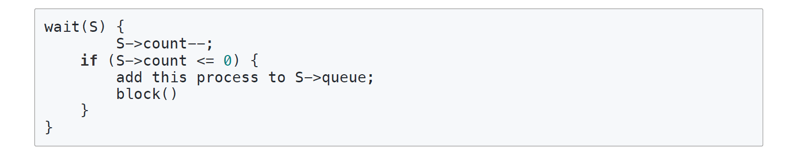

## Thread

### 쓰레드와 프로세스의 차이
|Thread|Process|
|---|---|
|프로세스의 서브셋|독립적인 하나의 유닛|
|프로세스의 자원 공유|프로세스는 독립적인 하나의 온전한 메모리를 가짐|
|주소 영역 공유 |독립적인 주소 영역 공유|
|Stack영역을 제외한 모든 공간을 공유하므로 스레드간 통신이 자유로움|IPC기법으로 프로세스간에 통신해야함|
### 쓰레드의 특징

* 쓰레드는 프로세스내에 여러개 존재할 수 있음.
* 하나의 작업 단위이지만 프로세스에 서브셋으로 존재함.
* 프로세스 역시 하나의 작업단위 이기 때문에 별도의 PC(Process Counter)와 SP(Stack Pointer)를 가짐
* 프로세스의 stack영역에 쓰레드를 위한 Stack영역이 만들어 짐
* 한 프로세스 안에 쓰레드들은 부모 프로세스의 stack영역을 제외한 모든 공간(heap, static, code)을 공유하기 때문에 동기화 이슈가 발생할 수 있음.

### 쓰레드 동기화
* 쓰레드는 각각 Stack역역을 가지지만, 메모리의 Heap영역을 공유하기 때문에 Heap영역 메모리에 여러 쓰레드가 접근하다보면 문제가 생길 수 있음
* 예를들어 쓰레드 A가 Heap영역의 특정 값을 수정하는 동안 쓰레드B가 Heap여역의 동일한 메모리 주소에 접근해서 해당 값을 바꾼다면 쓰레드A는 잘못된 값을 가지고 가는 경우가 있음
* 동기화 이슈가 말생하면 임계영역을 설정해서 해당 메모리에 동시에 들어갈 수 없도록 한다 (자바의 경우에는 synchronize 블럭을 사용함)
* 동시에 접근 하더라도 수정이 없이 읽기만 한다면 문제가 되지 않는다.

**쓰레드 동기화 이슈를 해결하는 방법들**

1.상호 배제(Mutual Exclusion)
* 상호 배제 기법은 임계 역역을 설정하고 한 개의 쓰레드만 접근 가능하도록 만듬 - 자바의 경우는 synchronize블럭
* 임계 영역을 어떠한 쓰레드가 점유하고 있다면 다음에 접근할 쓰레드는 기다림.
* 경우에 따라서는 교착상태가 발생하기도 함

2.세마포어
* 상호 배제 기법과 비슷하지만 임계 영역에 한 개의 쓰레드가 아닌 제한된 숫자(2개 이상)의 쓰레드만 접근하도록 하는 방법
* 세마포어를 구성하는 방법은 두가지가 있음
    1. 반복문으로 세마포어 값이 1 이상이때 까지 계속 체크
    

    2. 세마포어 값이 0이라면 해당 쓰레드를 sleep상태로 만들고 나중에 interrupt로 깨워서 ready상태로만듬
    
    
### 교착상태 & 기아상태
#### 교착상태
* 쓰레드들간에 서로 접근해야 하는 임계영역을 점유하고 반환하지 않아서 프로그램이 진행되지 못하고 무한 대기중인 상태 - 매우 크리티컬함....
* 교착상태의 발생 조건
    1. 상호배재: 프로세스들의 필요로 하는 자원에 대하여 배타적인 통제권을 요구함
    2. 점유대기: 프로세스가 할당된 자원을 가진 상태에서 다른 자원을 기다림
    3. 비선점: 프로세스가 어떤 자원의 사용을 끝낼때 까지 다른 프로세스가 그 자원을 뺏을 수 없음
    4. 각 프로세스는 순환적으로 다음 프로세스가 요구하는 자원을 가지고 있음

#### 기아상태
* 쓰레드들 간에 우선순위가 달라서, 또는 운(?)이 없어서 실행되지 못하고 쓰레드 풀에서 대기만 계속 하는 상태
* 기아 상태를 해결하기 위해선
    * 오래 기다린 쓰레드의 우선순위를 높여주는 알고리즘
    * FIFO기반의 큐를 구현
    * 프로세스간의 우선순위를 수시로 변경해주는 알고리즘