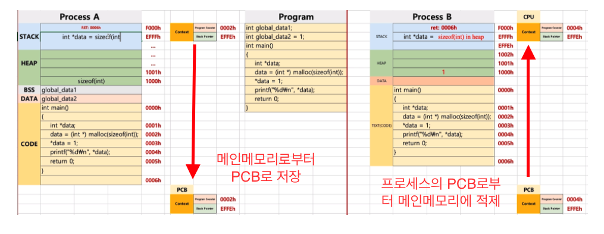

## Context Switching

### 컨택스트 스위칭이란?
멀티 프로세스 혹은 멀티 프로그래밍을 위해 cpu에서 실행할 프로세스를 주기적으로 교체하는 기술

### 컨택스트 스위칭 원리

1. CPU의 메인 메모리에 있는 PC(Process Counter)와 SP(Stack Pointer)의 값을 현재 running 상태의 해당 프로세스의 PCB(Process Control Block)에 저장한다.
2. running상태의 프로세스를 ready상태로 변경
3. ready상태의 프로세스(이제 시작할려는 프로세스)의 PCB에서 CPU의 메인메모리에 PC와 SP를 로드한다
4. 해당 프로세스를 running상태로 변경하고, 가져온 PC와 SP를 이용해서 **중단됬던 부분부터** 프로그램을 다시 실행한다.

### PCB(Process Control Block)

* PCB란 PC와 SP등을 저장한 공간으로 프로세스마다 별도의 공간을 가지고 있고 컨택스트 스위칭 시에 사용됨.

  * ID - 프로세스 아이디
  * CPU_state - CPU의 상태?!
  * Processer_ID - cpu의 코어 아이디(멀티코어의 경우)
  * Register - PC(Process Counter),SP(Stack Pointer) 정보
  * Parent - 부모 프로세스의 정보(fork등을 이용해서 자식프로세스를 생성한 경우)
  * Child - 자식 프로세스의 정보(fork등을 이용해서 자식프로세스를 생성한 경우)