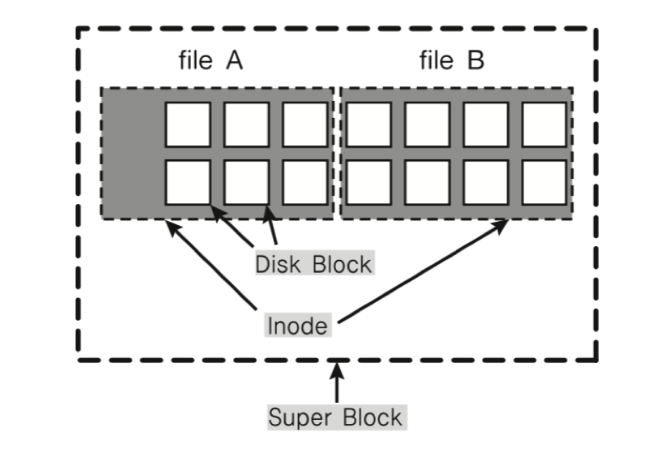
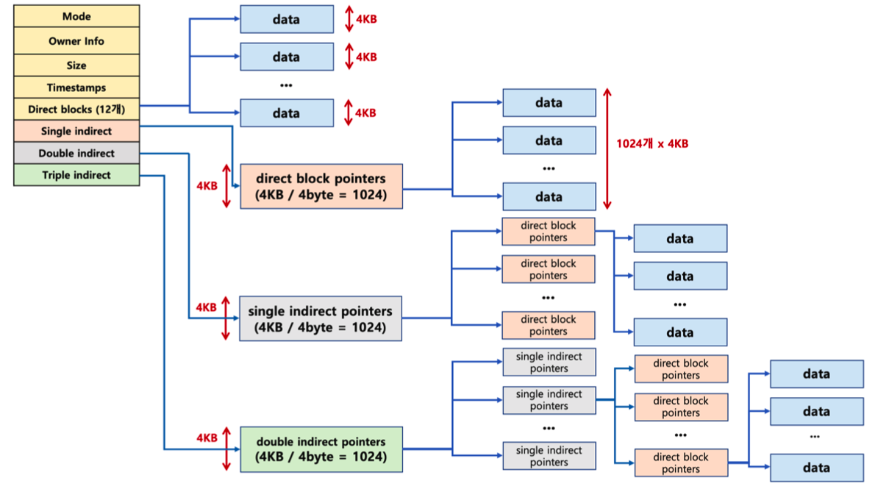

## inode

### File System4* 파일 시스템의 종류
* Windows - FAT, FAT32, NTFS 지원
* Linux - ext2, ext3, ext4 - 인덱스 블록 기법인 inode방식 사용

### inode 파일시스템
* inode의 파일 시스템 기본 구조는:
    * 수퍼블록 - 파일시스템의 정보를 담고 있음
    * 아이노드 블록 - 파일의 메타데이터를 담고 있음
    * 데이터 블록 - 실제 데이터를 담고 있는 블록

* 그림에서 보는 것 같이 **수퍼블록**은 운영체제의 모든 파일(파일 시스템)의 정보를 담고 있으며, **inode블록**은 한개의 파일 에대한 메타데이터를 담고 있음. 실제 데이터는 작은 크기의 **데이터블럭**에 담겨있음

### inode 블록의 구조와 데이터

* 파일이 생성되면 inode값을 가지게 되고(process가 프로세스 아이디를 가지게 되는 것과 유사함) inode블록에 메타 데이터를 보관하게 됨.
* 아이노드 블록은 데이터 블록을 계층화를 해서 담아두고 있음
  * Direct block - 블록의 크기는 최대 4kb인데 파일의 크기가 작을 경우 (48kb미만) 직접 direct block안에 보관하게 됨
  * single indirect - 파일 사이즈가 클경우 직접 블록을 보관하는게 아니라 블록의 주소값을 기록해 두었다가 주소값을 참조해서 데이터를 읽어드림 (4kb * 1024 = 최대 4mb)
  * double indirect - single indirect와 마찬가지로 직접 데이터를 가지고 있게 아니라 참조의 참조를 함으로서 더 큰 파일을 저장할 때 쓰임 (4kb * 1024 * 1024 = 최대4gb)
  * triple indirect - 마찬가지로 더 큰 파일을 담아두기 위해서 3중으로 계층화를 시켜 보관하고 있음 (4kb * 1024 * 1024 * 1024 = 최대4TB)
