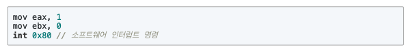

## Interrupt

### 인터럽트란
* CPU가 실행중일때 말그대로 운영체제가 interrupt(방해하기, 끼어들기)를해서 일련의 작업을 처리하는 것
* 주로 스케줄러의 구현이나 예외처리 또는 I/O장치에 대해서 쓰인다
* 간단하게 생각해서 어떠한 이벤트가 발생했을 때 처리하는 방법이라고 생각하면 됨

### 인터럽트 종류
* 내부 인터럽트 - 프로그램 내부에서 발생하는 인터럽트
    * 주로 프로그램에서 발생하는 예외처리 (얘를 들면 zero division exception)
    * 사용자 모드에서 커널영역의 메모리에 접근하는 경우
    * 계산 결과가 overflow날때
* 외부 인터럽트 - 프로그램 외부에서 발생하는 인터럽트
    * 키보드, 마우스 등의 I/O장비가 입력될 경우
    * 타이머 인터럽트 - 스캐쥴러의 구현을 위한 인터럽트
    * 저장매체에 접근하는 경우 등등

### 인터럽트 예시
1. 타이머 인터럽트
   

    
    
    위의 그림에서처럼 주기적으로 시간마다 인터럽트를 발생시켜 운영체제에게 컨택스트 스위칭을 하도록 시킴

    
    
    위의 그림은 간략한 컨택스트 스위칭 다이어그램인데 타임 인터럽트가 발생하면  running상태의 프로세스를 ready상태로 바꾸고 다른 ready 상태의 프로세스를 running상태로 돌려 실행 시킨다
  
    

2. 입출력 인터럽트
    
    

    system call로 하드디스크의 파일을 읽어올 경우 읽는 시간동안 해당 프로세스는 waiting 상태로 전환 되고 DMA에서 하드디스크의 파일을 다 가져오면 인터럽트를 발생시켜 waiting 상태의 프로세스를 ready상태로 깨운다

3. zero division exception 인터럽트
    
    

    예외가 발생할 경우 역시 인터럽트를 발생시켜 오류메세지등을 프린트해 사용자가 알 수 있게 끔 한다 - 전형적인 내부 인터럽트(프로그램 내에서 발생했기 때문에...)

### system call과 interrupt의 관계
* 사실은 system call 역시 인터럽트의 한 종류이며 내부적으로는 인터럽트를 호출함

    * eax레지스터에 호출할 시스템 콜 번호를 넣음 - system call table(시스템 콜의 동작을 정의한 테이블)의 인덱스 번호
    * ebx레지스터에 시스템 콜에 넘겨줄 파라미터 값을 넣음
    * int로 인터럽트 명령을 호출하면서 0x80 값을 넘김 - system call인터럽트 번호가 0x80
* 0x80으로 시스템 콜 인터럽트가 호출 되면 IDT(Interrupt Descriptor Table)- 인터럽트를 정의한 테이블 (인터럽트 루틴이 정의되어 있다 - 해당 인터럽트의 동작을 의미함)
  
* IDT(Interrupt Descriptor Table)에 정의된 인터럽트
    * 0~31 - 예외상황 인터럽트(일부는 정의되지 않은 채 남아있다)
    * 32~47 - 하드웨어 인터럽트(주변장치 종류/ 갯수에 따라 변동됨)
    * 128 - 시스템콜 (0x80)