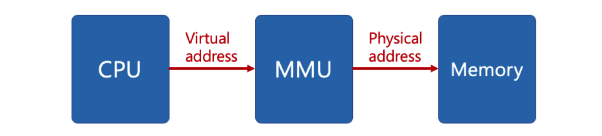
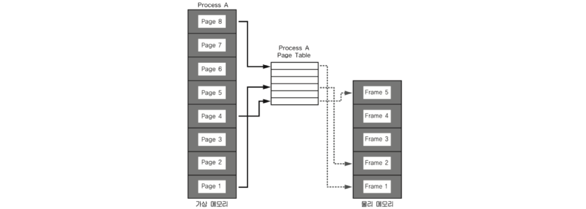
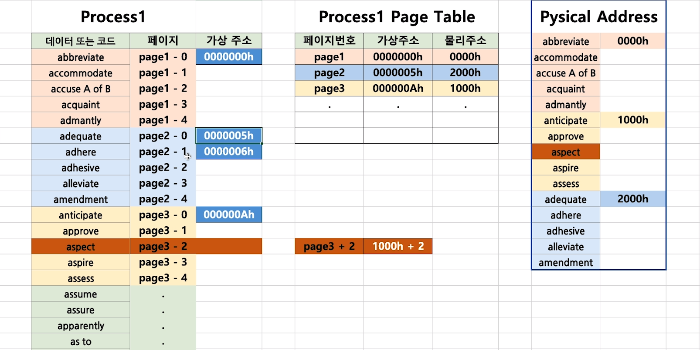
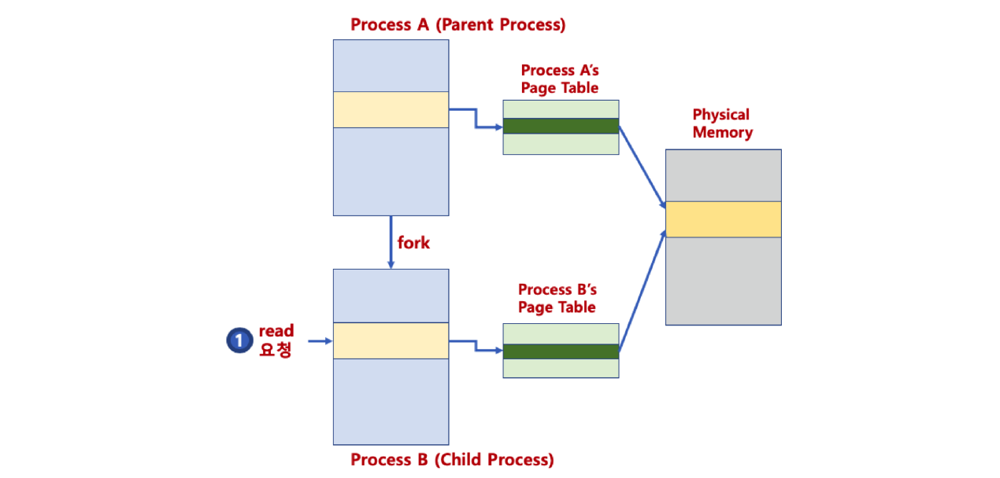
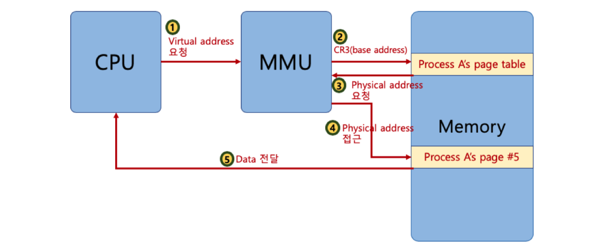
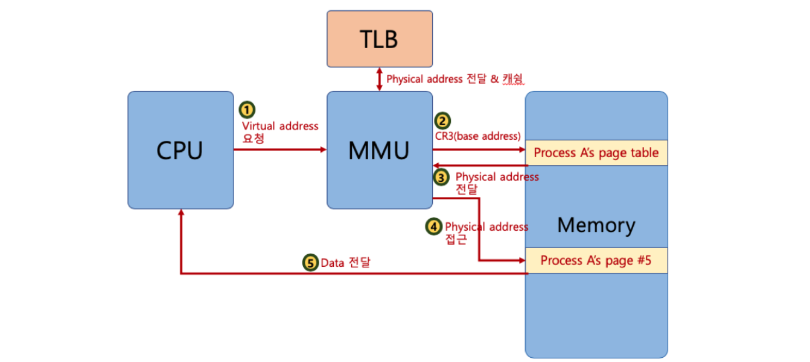
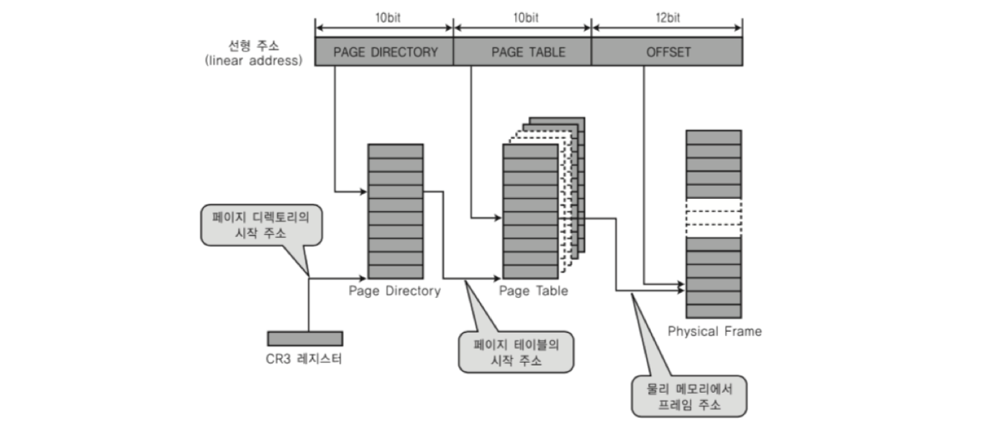
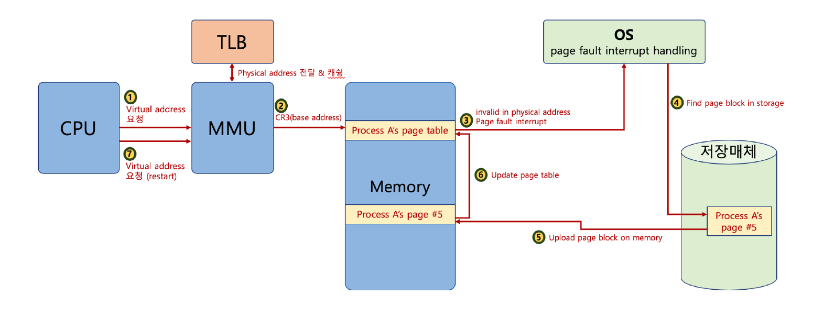

## Paging

### 가상 메모리
* 가상메모리 장점
    * 필요한 메모리만 동적으로 으로 올림 - 자원 효율적화
    * 가상의 메모리 주소를 사용하면서 다른 프로세스의 주소로 접근 X
* 가상 메모리 컨셉
    * 프로세스가 사용하는 주소는 가상주소이고, 가상 주소와 실제 데이터의 주소를 읽을 때 가상메모리와 실제 메모리가 매핑된 테이블로 접근해서 사용함
    * 가상메모리 - 프로세스가 참조하는 주소
    * 물리 메모리 - 실제 메모리의 주소
* MMU(Memory Management Unit) - CPU실행시, 가상 주소 메모리 접근이 필요할 때 해당 주소를 물리 주소 값으로 변환해 주는 하드웨어 장치

### 페이징 시스템
* 페이징이란: 
  * 크기가 동일한 페이지로 가상 주소 공간과 이에 매칭하는 물리 주소 공간을 관리 하는 개념 - 리눅스에서는 한 페이지는 4kb
  * 페이지 번호를 기반으로 가상 주소와 불리주소를 매핑해서 사용함
* PCB(Process Control Block)에는 page table이라는 가상 메모리와 물리 메모리를 매핑하는 테이블이 있음 (pcb에 있다는 말은 프로세스마다 하나씩 가지고 있다는 말임)

* 페이지 시스템의 동작 방법: 
  1. 프로세스의 페이지 테이블에서 가상 주소로 페이지 번호 찾기
  2. 페이지 테이블에서 페이지 번호로 물리주소 찾기
  3. 물리주소는 해당 주소의 제일 첫번째 주소 값을 가지고 있는데 가상 주소의 변우(위치 값)을 더해서 실제 물리주소의 메모리에 접근
  4. 예를 들어 페이지 테이블에 매핑된 물리 주소는 첫번째 주소니까, 실제 접근 위치는 - 테이블에 매핑된 주소 + 변워(0kb~4kb)
    

* 페이지 시스템과 공유메모리
  * fork()로 자식 프로세스를 생성하거나, 프로세스의 커널역역 메모리는 사실, 페이지시스템에서 동일한 메모리 주소값을 저장하고 있기 때문에 가능한 일임

* 페이징과 MMU(Memory Management Unit)

    * PCB애서 page table에 접근해서 물리 메모리에 필요한 메모리를 적재함
    * CR3라는 레지스터가 있는데 page table의 베이스 주소를 가지고 있으며 페이지 테이블은 이 CR3를 참조한다
    * CPU가 가상 주소에 접근하면 MMU가 page tabledml 베이스 주소로 접근해서 물리 주소를 가져옴
    * 한번 가지고 온 물리 메모리 주소는 TLB라는 공간에 캐싱해서 CR3를 참조하기 전에 있는지 확인 먼저 함
    

### 다중 단계 페이징
* 32bit의 페이징 시스템에서 4kb의 페이지를 위한 시스템은 10bit 이며 오프셋이 12bit은 페이지의 상위 디랙토리를 위한 공간이 10bit 해서 총 32bit임
* 페이지 디랙토리를 사용함으로서 필요없는 페이지 모두를 생성할 필요도 없기 때문에 효율적임

### 페이지 폴트
* 페이지 폴트란 - page table에서 실제 물리 주소에 접근하려 할때 물리 메모리에 필요한 정보가 로드 되어 있지 않다면 쓰지 않는 메모리를 비우고 필요한 메모리를 올리는 작업
* 페이지 폴트를 할때는 페이지 폴트 인터럽트를 발생시켜서 IDT(Interrupt Description Table)에서 해당 인터럽트 루틴을 찾아서 수행함
* 페이지 폴트 동작 과정

    1. cpu가 가상메모리의 메모리를 요청
    2. TLB에 캐싱된 물리 메모리 주소가 있는지 확인후 있으면 반환
    3. MMU가 CR3레지스터에서 page table의 주소로 접근하고 page table해서 해당 메모리가 적재되어 있는지 확인
    4. (적재되있지 않다면) 운영체제에 page fault인터럽트 발생시킴
    5. 운영체제는 page fault인터럽트를 받고 하드디스크에서 해당 데이터를 접근함
    6. 운영체제는 하드디스크에서 찾은 해당 데이터를 적재하고 page table을 업데이트함

### 페이징 교체 알고리즘
페이지 폴트가 빈번하게 일어나면 성능 저하의 원인이 되기 때문에 여러가지 알고리즘을 이용해서 페이지 폴트를 최저로 할수 있게끔 구현함 - 하지만 LRU(Least Recently Used)알고리즘이 제일 보편적임
* LRU(Least Recently Used) - 가장 오래전에 사용된 페이지를 교체함
* LFU(Least Frequently Used) - 가장 사용빈도가 적었던 페이지를 교체함
* NUR(Not Used Recently) - LRU와 동일하게 가장 최근에 사용하지 않은 페이지를 교체하는 기법이지만 가장 다른점은, 읽기와 쓰기를 구분해서 가장 적게 쓰인 페이지를 교체한다
  * (읽기, 쓰기) - e.g. 해당 페이지를 엙고 썼다면 (1,1), 해당 페이지를 읽기만 했다면 (1,0)
  * (0,0),(0,1),(1,0),(1,1) 순서로 페이지 교체