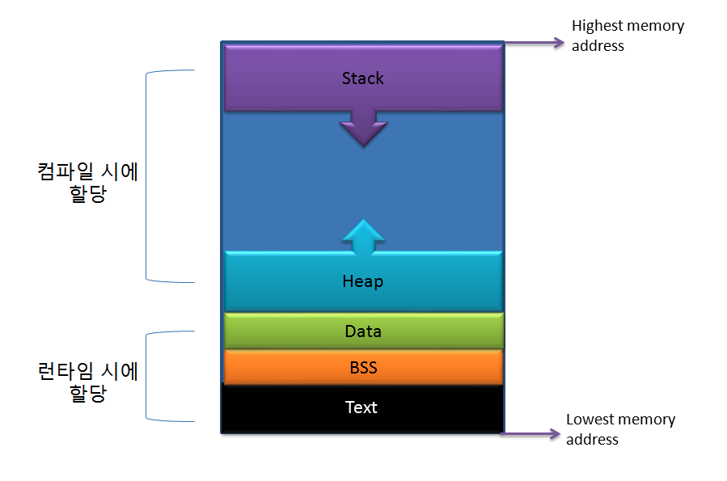
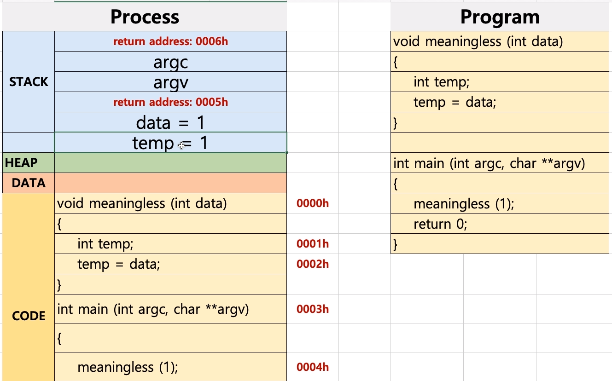
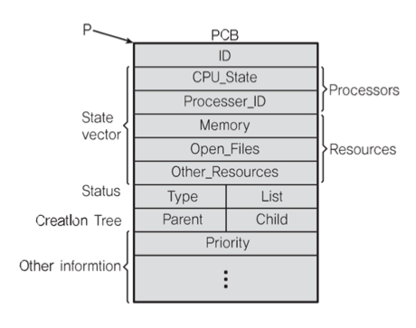

## 프로세스
### 프로세스 메모리 구조

* 프로세스 메모리 구조
    * code(text) - 컴파일 된 기계어가 로드되는 공간으로 읽기 전용이므로 수정이 불가능
    * data - global변수, static변수 등의 로드되는 공간
    * bss - global변수, static변수가 놓이는 공간이지만 아직 변수값이 할당되지 않은 변수들을 위한 공간
    * heap - 메모리를 동적으로 할당하기 위한 공간으로 자바에서는 객체들이 저장되는 공간이다. - stack에서는 heap영역에 있는 객체의 주소값을 가지고 있으며 가비지 컬랙터가 활동하는 곳
    * stack - 코드 블럭안에 들어가는 지역변수, 매개변수 리턴값 등이 저장되는 영역으로 함수가 실행을 마치면 바로 삭제되는 공간
* 프로세스는 가상 메모리를 사용함
* 프로세스의 메모리는 4GB이며 0~3GB까지는 프로세스만의 공간이며(위에 언급한 text,data,bss,heap,stack 등이 들어있는 영역), 3~4GB에는 커널영역이다
* 프로세스의 커널영역은 다른 프로세스들과 공유하므로 IPC(Inter Process Communication에 활용됨)

### 프로세스의 동작 방식

1. code 영역의 내용(실제로는 기계어)를 한줄씩 읽음 - PC(한줄 한줄 읽어가면서 Process Counter는 현재 읽고 있는 code영역의 주소값을 가지고 있는다)
2. code영역에서 읽어드린 내용을 바탕으로 heap영역, data 영역, stack 영역에 데이터를 로들함
3. stack영역에서는 함수와 지역변수가 올라감
   * stack에 함수를 로드하기 전에 함수가 끝나고 돌아갈 code역역의 주소값을 가지고 있는다
   * 함수가 실행되고 함수 및 변수가 stack영역에서 제거되면 저장되었던 code영역의 주소로 돌아간다. 
   * SP(Stack pointer) - SP가 stack의 주소값을 가르키면서 실행해 나간다. 실행된 코드는 stack영역에서 제거된다
\** PC(Process Counter)와 SP(Stack Pointer)를 가지고 있는 이유는 컨택스트 스위칭이 되면 바로 pc와 sp가 가르키고 있는 부분부터 읽을 수 있기 때문에 
### 프로세스와 PCB(Process Control Block)
* PCB란 PC와 SP등을 저장한 공간으로 프로세스마다 별도의 공간을 가지고 있고 컨택스트 스위칭 시에 사용됨.

  * ID - 프로세스 아이디
  * CPU_state - CPU의 상태?!
  * Processer_ID - cpu의 코어 아이디(멀티코어의 경우)
  * Register - PC(Process Counter),SP(Stack Pointer) 정보
  * Parent - 부모 프로세스의 정보(fork등을 이용해서 자식프로세스를 생성한 경우)
  * Child - 자식 프로세스의 정보(fork등을 이용해서 자식프로세스를 생성한 경우)