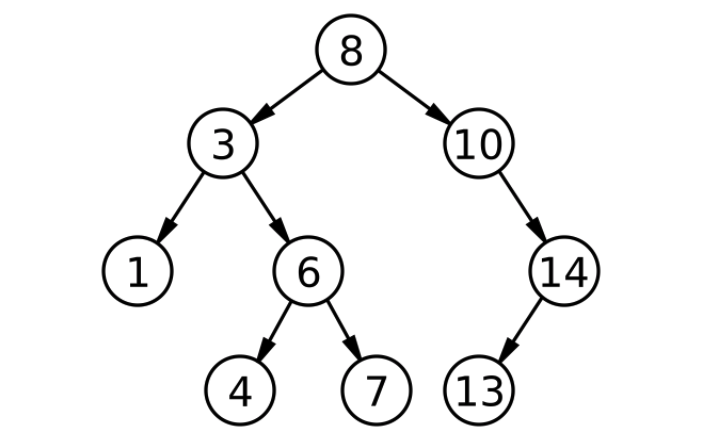

## Binary Tree
### 특징
* 링크드리스트처럼 노드를 이용해서 정보를 저장하지만 루트 노드에서부터 부모노드보다 큰값을 오른쪽에, 작은값을 왼쪽에다가 연결하는 구조를 바이너리 트리(이진트리)구조라고 함

* 이진트리의 장점은 탐색이 빠른 점임 O(logN) - 탐색할 데이터의 양이 늘어날 수록 탐새할 양은 더 많이 줄음
* 자바에서는 Tree라는 인터페이스를 보통 TreeSet으로 구현해 놓음

### 구현방법
* 삽입할 경우
  1. 노드와 노드 매니저 클래스를 만듬
  2. 노드 매니저에 노드를 넣을때 크기를 비교해서 부모노드보다 크면 오른쪽, 작으면 왼쪽에 넣음  - recursive로 구현해서 부모노드의 자식노드(오른쪽 또는 왼쪽)이 null일때 까지 탐색
* 삭제할 경우
    1. 삭제할 노드를 탐색
    2. 삭제할 노드가 리프노드라면 삭제만 하면 끝
    3. 만약 삭제할 노드가 자식노드가 있을 경우라면
        * 삭제할 노드를 가준으로 자식노드중 제일 작은 값 (제일 왼쪽에 있는 노드)를 삭제할 노드에 올림
        * 자식노드중 제일 작은 값(제일 왼쪽에 있는 노드)이 자식노드로 오른쪽노드(자기보다 큰값)를 가지고 있을 경우 - 삭제할 값 자리에 자식노드중 제일 작은 값을, 제일 작은 값 자리에 제일 작은 값의 오른쪽 노드를 두면 댐...

### 직접 구현해본 Binary Tree

**트리 노드**
```java
public class TreeNode {
    int value;
    TreeNode leftChild;
    TreeNode rightChild;

    public TreeNode(){};

    public TreeNode(int value){
        this.value = value;
    }

    public int getValue() {
        return value;
    }

    public TreeNode getLeftChild() {
        return leftChild;
    }

    public void setLeftChild(TreeNode leftChild) {
        this.leftChild = leftChild;
    }

    public TreeNode getRightChild() {
        return rightChild;
    }

    public void setRightChild(TreeNode rightChild) {
        this.rightChild = rightChild;
    }

    public boolean hasLeft(){
        if(this.leftChild==null)
            return false;
        return true;
    }

    public boolean hasRight(){
        if(this.rightChild==null)
            return false;
        return true;
    }

    public boolean isLeap(){
        if(!(hasLeft() || hasRight()))
            return true;
        return false;
    }
}

```

**구현**
```java
public class MyTree {

    TreeNode root;

    public void add(int value){
        if(root == null){
            root = new TreeNode(value);
        }
        else{
            insertSearch(root,value);
        }

    }

    public Integer poll(int value){
        return pollSearch(null,root,value);
    }

    public boolean contains(int value){
        return search(root, value);
    }

    private void insertSearch(TreeNode parent, int value){
        if(parent.getValue() == value)
            return;
        if(value < parent.getValue()){
            if(parent.getLeftChild() == null){
                parent.setLeftChild(new TreeNode(value));
            }else{
                insertSearch(parent.getLeftChild(),value);
            }
        }else if(value > parent.getValue()){
            if(parent.getRightChild() == null){
                parent.setRightChild(new TreeNode(value));
            }else{
                insertSearch(parent.getRightChild(),value);
            }
        }
    }

    private boolean search(TreeNode parent, int value){
        if(parent.getValue() == value)
            return true;
        if(value < parent.getValue()){
            if(parent.getLeftChild() == null)
                return false;
            else
                return search(parent.getLeftChild(),value);
        }else if(value > parent.getValue()){
            if(parent.getRightChild() == null)
                return false;
            else
                return search(parent.getRightChild(),value);
        }
        return false;
    }

    private Integer pollSearch(TreeNode parent, TreeNode target, int value){
        if(target == null)
            return null;
        if(target == parent && target.getValue() == value){
            TreeNode last = target;
            TreeNode lastParent = parent;
            while(last.hasLeft()){
                lastParent = last;
                last = last.getLeftChild();
            }

            if(last.isLeap()){
                if(parent.getLeftChild() == target){
                    parent.setLeftChild(last);
                }else{
                    parent.setRightChild(last);
                }
                lastParent.setLeftChild(null);
            }else{
                if(parent.getLeftChild() == target){
                    parent.setLeftChild(last);
                }else{
                    parent.setRightChild(last);
                }
                lastParent.setLeftChild(last.getRightChild());
            }
        }

        if(target.getValue() == value){
            if(target.isLeap()){
                if(parent.getLeftChild() == target){
                    parent.setLeftChild(null);
                }else{
                    parent.setRightChild(null);
                }
            }

            if(target.hasRight() && !target.hasLeft()){
                if(parent.getLeftChild() == target)
                    parent.setLeftChild(target.getRightChild());
                else
                    parent.setRightChild(target.getRightChild());
            }

            TreeNode last = target;
            TreeNode lastParent = parent;
            while(last.hasLeft()){
                lastParent = last;
                last = last.getLeftChild();
            }

            if(last.isLeap()){
                if(parent.getLeftChild() == target){
                    parent.setLeftChild(last);
                }else{
                    parent.setRightChild(last);
                }
                lastParent.setLeftChild(null);
            }else{
                if(parent.getLeftChild() == target){
                    parent.setLeftChild(last);
                }else{
                    parent.setRightChild(last);
                }
                lastParent.setLeftChild(last.getRightChild());
            }
            return target.getValue();
        }else if(target.getValue() < value){
            pollSearch(target,target.getLeftChild(),value);
        }else{
            pollSearch(target,target.getRightChild(),value);
        }
        return null;
    }
}

```