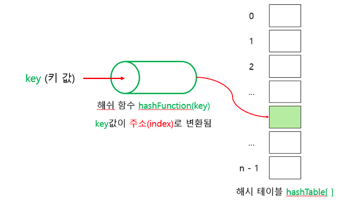
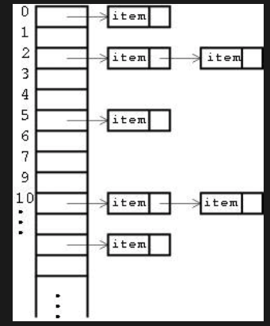

##  Hash Map
### 특징
* 해시맵은 해시값을 이용해서 데이터를 지정된 곳에 저장하는 자료구조로 검색이 매우 빠르다 O(1)으로 크기에 상관없이 한번만 수행되므로 매우 빠름 - 리스트 같은 경우 O(N) 
* 하지만 해시값이 중복될 경우 링크드 리스트로 연결하기 때문에 속도가 느려짐 - 따라서 충돌이 나지 않게 끔 하는것이 제일 중요하다.
* 저장공간의 크기가 클수록 해시 충돌의 확률이 적어짐
### Hash Table의 간략한? 구현방법 과 원리
1. hashing을 통하여 데이터로부터 해시값을 추출함
   - hasing이란 해시함수를 이용하여 어떤 값이 들어와도 특정 길이의 값을 반환하는 작업 (동일한 객체라면 언제나 동일한 해시값을 반환함)
2. 해시값을 나머지 연산(% - modulas)을 이용해서 얻어낸 키 값을 인덱스로 배열에 저장
   


그림과 같이 키값을 해싱(해시함수에 넣어서)해서 인덱스 값을 알아냄
1. 데이터를 저장하려 했는데 만약에 해당 인덱스가 중복되어서 이미 저장된 데이터가 있다면, 링크드리스트를 이용해서 뒤에다가 붙임 - (사실은 충돌시에 분리 연결법과 개방 주소법이 나뉘어 처리할 수 있는데 내가 구현한 방법은 분리 연결법으로 링크드리스트를 사용하였다.)
2. 해시테이블에서 값을 찾을때도 해시함수를 이요앻서 해싱하고 나머지 연산으로 인덱스 값을 얻어서 해당 데이터를 가져온다. - 이때도 중복된 값을 저장하느라 키값이 같지 않다면 연결리스트를 돌아가며 파라미터로 받은 키값을 찾을때 까지 검색한다.



그림과 같이 충돌이 발생할 경우 링크드리스트로 저장한다 - 하지만 성능이 저하되기 때문에 출돌이 발생하지 않게끔 하는게 제일 중요!

### 자바에서의 Hash Map
* 자바에서 제공하는 hash map의 api
    * put(key, value) - 해시에 키와 벨류를 저장하고 파라미터로 key와 value를 받음
    * putAll(map) - 파라미터로 받은 map을 모두 넣음
    * get(key) - 해당 키의 값을 반환함
    * remove(key) - 해당 키와 키의 값을 제거
    * clear() - hash map이 가지고 있는 모둔 데이터를 지움
    * isEmpty() - hash map이 비어있으면 true, 아니면 false를 리턴함
    * KeySet() - hash map의 키를 set으로 리턴함
    * Values() - hash map 의 값을 collection 객체로 리턴함
    * ContainsKey(key) - 파라미터로 받은 키가 hash map에 있다면 true 아니라면 false를 리턴
    * ContainsValue(value) - 파라미터로 받은 값이 hash map에 있다면 true 아니라면 false를 리턴
  
  \** hash map이나 hash set에 객체를 저장한다면, 그리고 equals()를 재정의 한다면 반드시 hashCode()도 재정의 해야한다. 왜냐하면, hash map이나 hash set에 객체를 저장할때 hashCode()를 이용해서 이 키값을 얻거나 유니크한지 판단하기 때문에... 

### 직접 구현해본 Hash Map

**Map 컨테이너?!**
```java
public class MapContainer<K,V> {
    private K key;
    private V value;
    private MapContainer<K,V> next;

    public MapContainer() {
    }

    public MapContainer(K key, V value) {
        this.key = key;
        this.value = value;
    }

    public K getKey() {
        return key;
    }

    public void setKey(K key) {
        this.key = key;
    }

    public V getValue() {
        return value;
    }

    public void setValue(V value) {
        this.value = value;
    }

    public MapContainer<K, V> getNext() {
        return next;
    }

    public void setNext(MapContainer<K, V> next) {
        this.next = next;
    }
}

```
**인터페이스**
```java
public interface MyMap<K,V> {
    public void put(K key, V value);
    public V get(K key);
    public boolean containsKey(K key);

}

```
**구현체**
```java
import dataStructures.MapContainer;
import dataStructures.myInterfaces.MyMap;

import java.util.ArrayList;
import java.util.List;

public class MyHashMap<K,V> implements MyMap<K,V> {
    private int size;
    List<MapContainer<K,V>> containers;

    public MyHashMap(){
        this(1000);
    }

    public MyHashMap(int size){
        this.size = size;
        containers = new ArrayList<>(size);
    }

    @Override
    public void put(K key, V value) {
        int index = getKey(hashing(key));
        if(!containers.contains(index)){
            containers.add(index, new MapContainer<>(key,value));
        }else{
            MapContainer<K,V> currentNode = containers.get(index).getNext();
            while(currentNode.getNext() != null){
                currentNode = currentNode.getNext();
            }
            currentNode.setNext(new MapContainer(key, value));
        }
    }

    @Override
    public V get(K key) {
        try{
            int index = getKey(hashing(key));
            MapContainer<K,V> currentNode = containers.get(index);
            while(currentNode != null){
                if(currentNode.getKey() == key)
                    return currentNode.getValue();
                currentNode = currentNode.getNext();
            }
            return null;

        }catch (Exception e){
            return null;
        }
    }

    @Override
    public boolean containsKey(K key) {
        if(containers.size() == 0){
            return false;
        }

        int index = getKey(hashing(key));
        if(containers.get(index)==null){
            return false;
        }else{
            MapContainer<K,V> currentNode = containers.get(index);
            while(currentNode !=null){
                if(currentNode.getKey()==key){
                    return true;
                }
                currentNode = currentNode.getNext();
            }
        }
        return false;
    }

    private int hashing(K key){
        return key.hashCode();
    }

    private int getKey(int hashed){
        return hashed % size;
    }
}

```