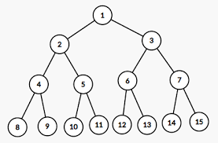

## Heap

### 특징
* 완전 이진트리의 구조로 모든 노드의 리프노드(자식노드를 가지고 있지 않은 말단 노드)의 depth가 모두 같음




완전이진트리

* 보통 heap의 구현은 배열로서 구현함
* 항상 첫번째 인덱스(0번 인덱스)의 값을 최소값 혹은 최대값으로 유지하기 때문에 최소값이나 최대값을 빠르게 찾아내는 옹도로 사용함
  * 최소힙 - 항상 0번 인덱스가 최소값인 힙
  * 최대힙 - 항상 0번 인덱스가 최대값인 힙
* 구현팁:
  1. 배열에서 자식노드를 구하는 방법
       * 부모노드 * 2 = 왼쪽노드
       * (부모노드 * 2)+1 = 오른쪽노드
  2. 자식노드에서 부모노드 구하는 방법:
     * (int) 자식노드/2 = 부모노드
* 힙에 데이터를 추가할 때는 일단 배열에 append시키고 추수에 최소값/최대값을 계산해서 0번인덱스에 위치하게 한다
    * e.g. recursive콜로 자신의 (인덱스/2)를 해가면서 부모노드 와 값을 비교함

### 직접 구현해본 Heap
```java

public class MyHeap {
    List<Integer> container = new ArrayList<>();
    public MyHeap(){ }

    public void add(Integer value){
        if(container.size() <=0)
            container.add(null);
        container.add(value);
        moveUp(container.size()-1);
         
    }

    public Integer poll(){
        Integer retVal = container.get(1);
        Integer last = container.get(container.size()-1);
        container.add(1,last);
        container.remove(container.get(container.size()-1));
        moveDown(1);
        return retVal;
    }

    public void printAll(){
        System.out.println(container.toString());
    }

    private void moveUp(int index){
        if(index < 1){
            return;
        }

        if(container.get(index)>container.get(index/2)){
            return;
        }else{
            swap(index, index/2);
            moveUp(index/2);
        }
    }

    private void moveDown(int index){
        if(index == container.size()-1)
            return;

        if (index >= container.size()-1)
            return;

        int current = container.get(index);
        if(index * 2 > container.size()-1)
            return;
        if(current > container.get(index*2)){
            swap(index, index*2);
            moveDown(index*2);
        }
        if((index * 2)+1 > container.size()-1)
            return;
        if(current > container.get((index*2)+1)){
            swap(index,(index*2)+1);
            moveDown((index*2)+1);
        }
    }

    private void swap(int a, int b){
        int temp = container.get(a);
        container.add(a,container.get(b));
        container.add(b,temp);
    }
}

```